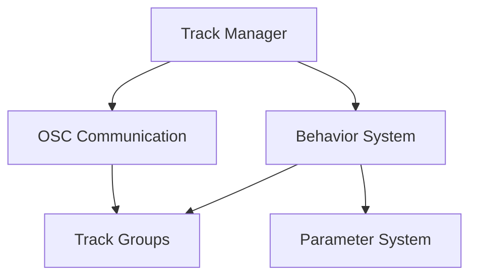

# Holophonix Track Motion Animator 🎵

A cross-platform desktop application for creating and managing motion behaviors for Holophonix spatial audio tracks via OSC. Create complex spatial movements using absolute or relative coordinate changes in both AED (Azimuth, Elevation, Distance) and XYZ coordinate systems.

## Features

### Motion Behaviors 🔄
- **1D Behaviors**
  - Linear oscillation (single axis)
  - Sine wave
  - Random walk 1D
  - Relative drift

- **2D Behaviors**
  - Circular (XY, XZ, or YZ plane)
  - Figure-8
  - Random walk 2D
  - Spiral
  - Custom paths

- **3D Behaviors**
  - Spherical orbit
  - 3D spiral
  - Random walk 3D
  - Composite movements

### Coordinate Systems 🌐
- **AED (Azimuth, Elevation, Distance)**
  - Azimuth: -180° to +180° or 0° to 360°
  - Elevation: -90° to +90° (vertical angle)
  - Distance: 0 to max_distance (radius from origin)

- **XYZ (Cartesian)**
  - X coordinate: left (-) to right (+)
  - Y coordinate: back (-) to front (+)
  - Z coordinate: down (-) to up (+)

Both coordinate systems are fully supported for:
- Direct position input
- Motion behavior calculations
- Real-time coordinate conversion
- Relative and absolute movements

### Unit Conversions & Transformations 🔄

#### Coordinate Transformations
```
AED ↔ XYZ Conversion:
X = Distance × cos(Elevation) × cos(Azimuth)
Y = Distance × cos(Elevation) × sin(Azimuth)
Z = Distance × sin(Elevation)

XYZ ↔ AED Conversion:
Distance = √(X² + Y² + Z²)
Azimuth = atan2(Y, X)
Elevation = asin(Z / Distance)
```

#### Unit Handling
- **Angles**
  - Internal: Radians
  - Display: Degrees
  - OSC: Degrees
  - Conversion: rad = deg × (π/180)

- **Distances**
  - Internal: Meters
  - Display: Meters/Feet (configurable)
  - OSC: Meters
  - Range: 0 to configurable max

- **Positions**
  - Normalized: -1.0 to 1.0
  - Absolute: Based on room size
  - Relative: Delta from current

#### Value Constraints
- **Azimuth**
  - Range: -180° to +180° or 0° to 360°
  - Wrap-around handling
  - Shortest path calculation

- **Elevation**
  - Range: -90° to +90°
  - Pole handling
  - Clamping at extremes

- **Distance**
  - Minimum: 0
  - Maximum: Room size or custom
  - Scaling options

### OSC Communication 📡
- **Track Control Paths**
  ```
  # Individual absolute coordinates
  /track/{id}/azim {value}  # Azimuth angle
  /track/{id}/elev {value}  # Elevation angle
  /track/{id}/dist {value}  # Distance from origin
  /track/{id}/x {value}     # X coordinate
  /track/{id}/y {value}     # Y coordinate
  /track/{id}/z {value}     # Z coordinate

  # Individual relative movements
  /track/{id}/azim+ {delta}  # Relative change in azimuth
  /track/{id}/elev+ {delta}  # Relative change in elevation
  /track/{id}/dist+ {delta}  # Relative change in distance
  /track/{id}/x+ {delta}     # Relative change in x
  /track/{id}/y+ {delta}     # Relative change in y
  /track/{id}/z+ {delta}     # Relative change in z

  # Combined coordinates
  /track/{id}/aed {azimuth} {elevation} {distance}  # All AED values
  /track/{id}/xyz {x} {y} {z}                       # All XYZ values
  /track/{id}/ae {azimuth} {elevation}              # Azimuth and elevation
  /track/{id}/xy {x} {y}                            # X and Y coordinates
  ```

- **Pattern Matching** 🎯
  OSC addresses support pattern matching for controlling multiple tracks:
  ```
  # Pattern matching characters
  ? - matches any single character
  * - matches any sequence of characters
  [abc] - matches any character in the list
  [!abc] - matches any character not in the list
  {foo,bar} - matches either 'foo' or 'bar'

  # Examples
  /track/[1-4]/xyz 0 0 0     # Set position for tracks 1-4
  /track/*/azim 90           # Set azimuth for all tracks
  /track/[!0]/active 1       # Activate all tracks except 0
  /track/{1,3,5}/dist 2      # Set distance for tracks 1, 3, and 5
  ```

- **Track Groups** 👥
  The application uses pattern syntax to define and control track groups. Unlike individual track control, a track group is treated as a single entity:
  ```
  # Range Groups
  [1-4]     # A single group controlling tracks 1, 2, 3, 4
  [2-10]    # A single group controlling tracks 2 through 10

  # Enumeration Groups
  {1,3,5}   # A single group controlling tracks 1, 3, and 5
  {1,5,10}  # A single group controlling tracks 1, 5, and 10
  ```

  Group characteristics:
  - Appears as a single entry in the track list
  - All tracks in the group share the same behaviors
  - Behaviors are applied uniformly across the group
  - Position changes affect all tracks simultaneously
  - Groups can be enabled/disabled as a unit
  - OSC messages are sent to all tracks in the group

- **Connection Settings** ⚙️
  - Default Input Port: 9000
  - Default Output Port: 12000
  - Default Host: localhost
  - Protocol: UDP
  - Message Format: OSC 1.0

## Development Status 🚀

### Recently Completed ✨
- Track List Management
  - [x] Track component implementation
  - [x] Group component implementation
  - [x] Selection system
  - [x] Drag and drop organization
  - [x] Pattern-based track creation
  - [x] Group merging and splitting
  - [x] Active/inactive states
  - [x] Individual track state management
  - [x] Group selection functionality
  - [x] Independent track toggling within groups
- Drag and Drop System
  - [x] Track reordering
  - [x] Group reordering
  - [x] Track-to-group merging
  - [x] Group-to-track extraction
  - [x] Visual drag feedback
  - [x] Automatic group cleanup
- Visual Design
  - [x] Distinct color palettes for tracks and groups
  - [x] Improved scrolling functionality
  - [x] Enhanced visual feedback
  - [x] Better form organization
  - [x] Consistent styling system

### Implemented Features ✅
- Modern React-based UI structure
  - Three-column layout design
  - Component hierarchy setup
  - Dark theme implementation
  - Color-coded tracks and groups
  - Responsive form layouts
- Track and Group Management
  - Individual and group selection
  - Independent track states
  - Collapsible groups
  - Pattern-based creation
  - Drag and drop organization
- Behavior system foundation
  - Base behavior interface
  - Behavior registry
  - Initial implementations (Linear, Sine, Circular, Orbit)
- Pattern-based track grouping design
  - Range patterns [1-n]
  - Enumeration patterns {n,m,p}
  - Group-based control concept

### In Progress 🚧
- Track List Refinements
  - [ ] Fix group merging edge cases
  - [ ] Improve drag and drop visual feedback
  - [ ] Add group collapse/expand animations
  - [ ] Optimize performance for large lists
  - [ ] Add keyboard shortcuts for common actions
  - [ ] Implement multi-select functionality
- Basic Behaviors
  - [x] Base behavior interface
  - [x] Behavior registry
  - [ ] Parameter validation
  - [ ] Behavior controls (play/pause/stop)
  - [ ] Visual behavior preview
  - [ ] Real-time parameter adjustment
- OSC Communication
  - [ ] Client implementation
  - [ ] Server implementation
  - [ ] Message formatting
  - [ ] Connection management
  - [ ] Real-time position updates
  - [ ] State synchronization
- Testing and Optimization
  - [ ] Unit test implementation
  - [ ] Performance optimization
  - [ ] Error boundary setup
  - [ ] State management refinement
  - [ ] Component rendering optimization
  - [ ] Memory usage monitoring

### Pending Features 📋
- Parameter System
  - Unit conversion
  - Value constraints
  - Real-time validation
- Behavior Controls
  - Progress visualization
  - Time synchronization
  - State persistence
- Group Dynamics
  - Leader/follower relationships
  - Geometric formations
  - Synchronized movements
- Advanced Features
  - Track filtering and search
  - Batch operations
  - Custom behavior creation
  - Multi-select operations

## Next Steps 🎯

### Behavior System Enhancement 🔄
1. **Core Implementations**
   - Complete base behaviors (Linear, Sine)
   - Add 2D behaviors (Circular, Figure-8)
   - Add 3D behaviors (Orbit, Spiral)
   - Implement parameter validation

2. **Parameter System**
   - Value range constraints
   - Unit conversion handling
   - Real-time validation
   - Default value management

3. **Behavior Control**
   - Play/Pause/Stop functionality
   - Progress tracking
   - Time synchronization
   - State persistence

### Track Management 👥
1. **Group Features**
   - Drag and drop organization
   - Collapsible group view
   - Group state management
   - Pattern-based selection

2. **Track Controls**
   - Position monitoring
   - State visualization
   - Quick actions
   - Batch operations

### System Stability 🛠️
1. **Error Handling**
   - OSC connection recovery
   - Invalid parameter detection
   - State inconsistency resolution
   - Error logging and reporting

2. **Performance**
   - Behavior calculation optimization
   - Message batching
   - UI responsiveness
   - Memory management

### Testing & Validation ✅
1. **Unit Tests**
   - Coordinate transformations
   - Behavior calculations
   - Parameter validation
   - Group operations

2. **Integration Tests**
   - OSC communication
   - UI interactions
   - State management
   - Error scenarios

### Documentation 📚
1. **Code Documentation**
   - API documentation
   - Component documentation
   - Type definitions
   - Example usage

2. **User Documentation**
   - Setup guide
   - Usage tutorials
   - Behavior examples
   - Troubleshooting guide

## Current Sprint Tasks 🎯

### Priority 1: Core Implementation
- [ ] Complete Track List UI
  - Basic track display
  - Group display
  - Selection handling
  - Context menu

### Priority 2: Behavior System
- [ ] Behavior Controls
  - Play/Pause/Stop buttons
  - Progress indicator
  - Delete functionality
  - Parameter editing

### Priority 3: OSC Setup
- [ ] Basic Communication
  - Connection setup
  - Message handling
  - Error recovery
  - Status display

## Architecture Overview 🏗️

### Core Components


### Main Systems
1. **Track Management**
   - Individual tracks and groups
   - Pattern-based grouping
   - Position tracking

2. **Behavior System**
   - Behavior registry
   - Parameter management
   - Coordinate transformations

3. **OSC Communication**
   - UDP messaging
   - Group updates
   - Position queries

## Project Structure 📁
```
src/
├── main/                      # Electron main process
│   ├── ipc/                  # IPC communication
│   │   ├── handlers.ts       # IPC message handlers
│   │   └── types.ts          # IPC message types
│   └── osc/                  # OSC communication
│       ├── client.ts         # OSC client implementation
│       ├── server.ts         # OSC server implementation
│       └── messages.ts       # OSC message formatting
│
├── renderer/                  # React application
│   ├── components/           # React components
│   │   ├── TrackList/       # Track management
│   │   │   ├── TrackItem.tsx
│   │   │   └── GroupItem.tsx
│   │   ├── Behaviors/       # Behavior management
│   │   │   ├── BehaviorList.tsx
│   │   │   └── Controls.tsx
│   │   └── Parameters/      # Parameter editing
│   │       ├── Editor.tsx
│   │       └── Constraints.tsx
│   │
│   ├── behaviors/           # Behavior system
│   │   ├── base.ts         # Base interfaces
│   │   ├── registry.ts     # Behavior registry
│   │   └── implementations/# Behavior implementations
│   │       ├── linear.ts
│   │       ├── sine.ts
│   │       └── circular.ts
│   │
│   ├── store/              # State management
│   │   ├── tracks.ts       # Track state
│   │   ├── behaviors.ts    # Behavior state
│   │   └── connection.ts   # OSC connection state
│   │
│   └── utils/              # Utility functions
│       ├── coordinates.ts  # Coordinate transformations
│       ├── validation.ts   # Parameter validation
│       └── conversion.ts   # Unit conversions
│
└── types/                  # Shared type definitions
    ├── behaviors.ts        # Behavior types
    ├── coordinates.ts      # Coordinate types
    └── messages.ts         # Message types
```

### Key Components

#### Main Process
- **IPC Layer**: Handles communication between main and renderer processes
- **OSC Module**: Manages OSC communication with Holophonix server
  - Client: Sends position updates and queries
  - Server: Receives position updates
  - Messages: Formats OSC messages

#### Renderer Process
- **Components**: React UI components organized by feature
  - TrackList: Track and group management
  - Behaviors: Behavior selection and control
  - Parameters: Parameter editing interface

- **Behavior System**: Core behavior functionality
  - Base: Common interfaces and abstract classes
  - Registry: Available behavior definitions
  - Implementations: Specific behavior types

- **State Management**: Application state organization
  - Tracks: Track and group state
  - Behaviors: Active behaviors and parameters
  - Connection: OSC connection status

- **Utilities**: Helper functions and tools
  - Coordinates: Coordinate system transformations
  - Validation: Parameter validation rules
  - Conversion: Unit conversion utilities

#### Shared Types
- Common type definitions used across the application
- Ensures type safety between processes
- Defines message formats and structures

## Development Roadmap 🗺️

### Current Sprint 🏃
- [ ] Track List Management
  - Drag and drop
  - Group handling
  - Visual organization
- [ ] Basic Behaviors
  - Linear and Sine
  - Parameter system
  - Coordinate handling
- [ ] Behavior Controls
  - Play/Pause/Stop functionality
  - Progress visualization
  - Status indicators
  - Delete operations

### Next Up 📅
- [ ] OSC Communication
  - Group messaging
  - Error handling
  - Connection recovery
- [ ] Advanced Behaviors
  - 2D/3D implementations
  - Behavior chaining
  - Parameter validation

### Future Features 🔮
1. **Advanced Behavior System**
   - Behavior composition and blending
   - Layered behaviors (base, modifier, effect)
   - Timeline-based sequencing
   - Custom behavior creation

2. **Group Dynamics**
   - Leader/Follower relationships
     * Leader track defines primary motion
     * Followers with configurable delay/offset
     * Multiple leader hierarchies
   - Geometric Formations
     * Isobarycentric positioning
     * Relative spacing control
     * Formation maintenance
   - Group Motion Patterns
     * Swarm behavior
     * Synchronized movements
     * Relative phase offsets

3. **Interaction Models**
   - Distance-based triggers
   - State-based responses
   - Time-based synchronization
   - Physics-based movements

4. **User Experience**
   - Parameter presets
   - Undo/redo system
   - Behavior visualization
   - Performance monitoring

5. **System Integration**
   - Configuration persistence
   - External control integration
   - Multi-device synchronization
   - Resource optimization

### Backlog 📝
- State persistence
- Bulk operations
- Track templates
- Performance optimization

## User Interface Layout 🎨

The application uses a three-column layout optimized for efficient track and behavior management:

### Left Column: Track List 📋
- Track management interface
- Individual and group tracks
- Drag and drop organization
- Track activation toggles
- Selection for behavior editing

### Middle Column: Behaviors 🔄
- Available behavior categories (1D, 2D, 3D)
- Behavior selection and addition
- Applied behaviors list with controls:
  - Play/Pause/Stop buttons
  - Delete behavior option
  - Progress bar visualization
  - Behavior status indicator
- Behavior activation toggles

### Right Column: Parameters ⚙️
- Parameter editing for selected behavior
- Real-time value updates
- Parameter constraints
- Value validation
- Numeric input fields

### Header Bar 🔝
- Application title
- OSC connection status
- Connection settings
  - Input port (local)
  - Output port (remote)
  - Host address
- Connection controls

This layout provides:
- Clear visual hierarchy
- Efficient workflow
- Minimal window switching
- Easy track organization
- Quick behavior assignment
- Immediate parameter access

## Development Setup 🛠️

### Prerequisites
- Node.js (v22.1.0 or higher)
- Yarn package manager
- Git

### Installation
```bash
# Clone the repository
git clone https://github.com/yourusername/holophonix-animator.git

# Navigate to project directory
cd holophonix-animator

# Install dependencies
yarn install
```

### Development
```bash
# Start development server
yarn start

# The app will open automatically with:
# - Hot Module Replacement enabled
# - DevTools available
# - Default OSC ports: 9000 (in) / 12000 (out)
```

### Building
```bash
# Create production build
yarn build

# The built app will be in the 'out' directory
# Supported platforms: Windows, macOS, Linux
```

### Configuration
The app can be configured through:
- Command line arguments
- Configuration file
- Environment variables

Example configuration:
```bash
# Custom OSC configuration
yarn start --osc-in=9001 --osc-out=12001 --osc-host=192.168.1.100

# Or using environment variables
OSC_IN_PORT=9001 OSC_OUT_PORT=12001 OSC_HOST=192.168.1.100 yarn start
```

Default OSC settings:
- Input Port: 9000 (local UDP server)
- Output Port: 12000 (remote Holophonix server)
- Host: localhost (change to your Holophonix server IP)
- Protocol: UDP
- Message Format: OSC 1.0
