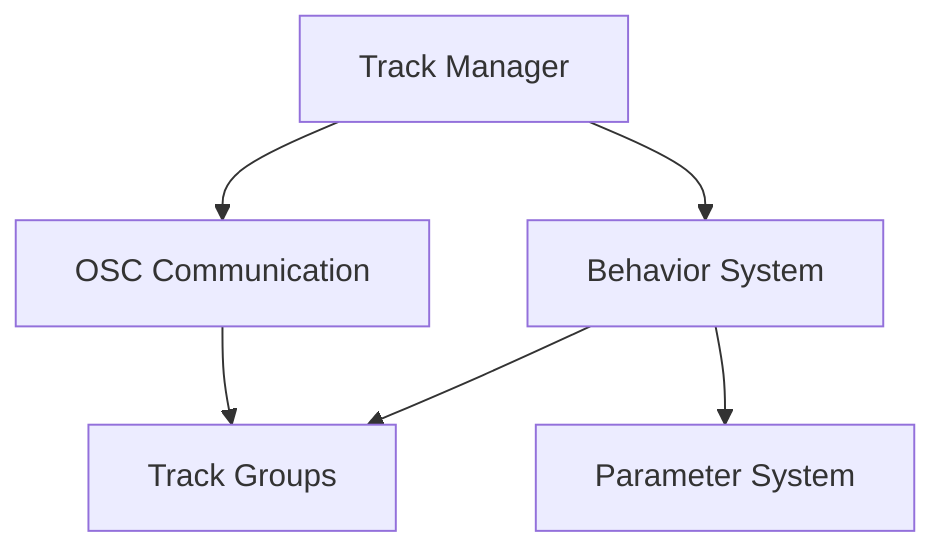

# Holophonix Track Motion Animator 🎵

A future (WIP) cross-platform desktop application for creating and managing motion behaviors for Holophonix spatial audio tracks via OSC. Create complex spatial movements using absolute or relative coordinate changes in both AED (Azimuth, Elevation, Distance) and XYZ coordinate systems. Development helped with windsurf ide (AI based).

> 🚧 **Development Status**: This project is under active development. See [DEVELOPMENT.md](DEVELOPMENT.md) for detailed progress, roadmap, and contribution guidelines.

> 📡 **OSC Protocol**: For detailed information about the OSC communication protocol, message formats, and track control, see [OSC.md](OSC.md).

## Features

### Motion Behaviors 🔄
- **1D Behaviors**
  - Linear oscillation (single axis)
  - Sine wave
  - Random walk 1D
  - Relative drift

- **2D Behaviors**
  - Circular (XY, XZ, or YZ plane)
  - Figure-8
  - Random walk 2D
  - Spiral
  - Custom paths

- **3D Behaviors**
  - Spherical orbit
  - 3D spiral
  - Random walk 3D
  - Composite movements

### Track Groups 👥
The application supports flexible track grouping for efficient control of multiple tracks:

```
# Range Groups
[1-4]     # A single group controlling tracks 1, 2, 3, 4
[2-10]    # A single group controlling tracks 2 through 10

# Enumeration Groups
{1,3,5}   # A single group controlling tracks 1, 3, and 5
{1,5,10}  # A single group controlling tracks 1, 5, and 10
```

Group characteristics:
- Appears as a single entry in the track list
- All tracks in the group share the same behaviors
- Behaviors are applied uniformly across the group
- Position changes affect all tracks simultaneously
- Groups can be enabled/disabled as a unit
- Synchronized movement across grouped tracks

### Coordinate Systems 🌐
- **AED (Azimuth, Elevation, Distance)**
  - Azimuth: -180° to +180° or 0° to 360°
  - Elevation: -90° to +90° (vertical angle)
  - Distance: 0 to max_distance (radius from origin)

- **XYZ (Cartesian)**
  - X coordinate: left (-) to right (+)
  - Y coordinate: back (-) to front (+)
  - Z coordinate: down (-) to up (+)

Both coordinate systems are fully supported for:
- Direct position input
- Motion behavior calculations
- Real-time coordinate conversion
- Relative and absolute movements

### Unit Conversions & Transformations 🔄

#### Coordinate Transformations
```
AED ↔ XYZ Conversion:
X = Distance × cos(Elevation) × cos(Azimuth)
Y = Distance × cos(Elevation) × sin(Azimuth)
Z = Distance × sin(Elevation)

XYZ ↔ AED Conversion:
Distance = √(X² + Y² + Z²)
Azimuth = atan2(Y, X)
Elevation = asin(Z / Distance)
```

#### Unit Handling
- **Angles**
  - Internal: Radians
  - Display: Degrees
  - OSC: Degrees
  - Conversion: rad = deg × (π/180)

- **Distances**
  - Internal: Meters
  - Display: Meters/Feet (configurable)
  - OSC: Meters
  - Range: 0 to configurable max

- **Positions**
  - Normalized: -1.0 to 1.0
  - Absolute: Based on room size
  - Relative: Delta from current

#### Value Constraints
- **Azimuth**
  - Range: -180° to +180° or 0° to 360°
  - Wrap-around handling
  - Shortest path calculation

- **Elevation**
  - Range: -90° to +90°
  - Pole handling
  - Clamping at extremes

- **Distance**
  - Minimum: 0
  - Maximum: Room size or custom
  - Scaling options

### OSC Communication 📡
The application communicates with Holophonix using the Open Sound Control (OSC) protocol over UDP. See [OSC.md](OSC.md) for detailed information about:
- Track control messages
- Pattern matching
- Group control
- Connection settings

## Architecture Overview 🏗️

### Core Components


### Main Systems
1. **Track Management**
   - Individual tracks and groups
   - Pattern-based grouping
   - Position tracking

2. **Behavior System**
   - Behavior registry
   - Parameter management
   - Coordinate transformations

3. **OSC Communication**
   - UDP messaging
   - Group updates
   - Position queries

## Project Structure 📁
```
src/
├── main/                      # Electron main process
│   ├── ipc/                  # IPC communication
│   │   ├── handlers.ts       # IPC message handlers
│   │   └── types.ts          # IPC message types
│   └── osc/                  # OSC communication
│       ├── client.ts         # OSC client implementation
│       ├── server.ts         # OSC server implementation
│       └── messages.ts       # OSC message formatting
│
├── renderer/                  # React application
│   ├── components/           # React components
│   │   ├── TrackList/       # Track management
│   │   │   ├── TrackItem.tsx
│   │   │   └── GroupItem.tsx
│   │   ├── Behaviors/       # Behavior management
│   │   │   ├── BehaviorList.tsx
│   │   │   └── Controls.tsx
│   │   └── Parameters/      # Parameter editing
│   │       ├── Editor.tsx
│   │       └── Constraints.tsx
│   │
│   ├── behaviors/           # Behavior system
│   │   ├── base.ts         # Base interfaces
│   │   ├── registry.ts     # Behavior registry
│   │   └── implementations/# Behavior implementations
│   │       ├── linear.ts
│   │       ├── sine.ts
│   │       └── circular.ts
│   │
│   ├── store/              # State management
│   │   ├── tracks.ts       # Track state
│   │   ├── behaviors.ts    # Behavior state
│   │   └── connection.ts   # OSC connection state
│   │
│   └── utils/              # Utility functions
│       ├── coordinates.ts  # Coordinate transformations
│       ├── validation.ts   # Parameter validation
│       └── conversion.ts   # Unit conversions
│
└── types/                  # Shared type definitions
    ├── behaviors.ts        # Behavior types
    ├── coordinates.ts      # Coordinate types
    └── messages.ts         # Message types
```

### Key Components

#### Main Process
- **IPC Layer**: Handles communication between main and renderer processes
- **OSC Module**: Manages OSC communication with Holophonix server
  - Client: Sends position updates and queries
  - Server: Receives position updates
  - Messages: Formats OSC messages

#### Renderer Process
- **Components**: React UI components organized by feature
  - TrackList: Track and group management
  - Behaviors: Behavior selection and control
  - Parameters: Parameter editing interface

- **Behavior System**: Core behavior functionality
  - Base: Common interfaces and abstract classes
  - Registry: Available behavior definitions
  - Implementations: Specific behavior types

- **State Management**: Application state organization
  - Tracks: Track and group state
  - Behaviors: Active behaviors and parameters
  - Connection: OSC connection status

- **Utilities**: Helper functions and tools
  - Coordinates: Coordinate system transformations
  - Validation: Parameter validation rules
  - Conversion: Unit conversion utilities

#### Shared Types
- Common type definitions used across the application
- Ensures type safety between processes
- Defines message formats and structures

## User Interface Layout 🎨

The application uses a three-column layout optimized for efficient track and behavior management:

### Left Column: Track List 📋
- Track management interface
- Individual and group tracks
- Drag and drop organization
- Track activation toggles
- Selection for behavior editing

### Middle Column: Behaviors 🔄
- Available behavior categories (1D, 2D, 3D)
- Behavior selection and addition
- Applied behaviors list with controls:
  - Play/Pause/Stop buttons
  - Delete behavior option
  - Progress bar visualization
  - Behavior status indicator
- Behavior activation toggles

### Right Column: Parameters ⚙️
- Parameter editing for selected behavior
- Real-time value updates
- Parameter constraints
- Value validation
- Numeric input fields

### Header Bar 🔝
- Application title
- OSC connection status
- Connection settings
  - Input port (local)
  - Output port (remote)
  - Host address
- Connection controls

This layout provides:
- Clear visual hierarchy
- Efficient workflow
- Minimal window switching
- Easy track organization
- Quick behavior assignment
- Immediate parameter access

## Configuration ⚙️

### Default Settings
- **OSC Configuration**
  - Input Port: 9000 (local UDP server)
  - Output Port: 12000 (remote Holophonix server)
  - Host: localhost (change to your Holophonix server IP)
  - Protocol: UDP
  - Message Format: OSC 1.0

### Configuration Methods
The app can be configured through:
- Command line arguments
- Configuration file
- Environment variables

### Example Configurations
```bash
# Using command line arguments
yarn start --osc-in=9001 --osc-out=12001 --osc-host=192.168.1.100

# Using environment variables
OSC_IN_PORT=9001 OSC_OUT_PORT=12001 OSC_HOST=192.168.1.100 yarn start
```

### Configuration File
Create a `config.json` in the application directory:
```json
{
  "osc": {
    "inPort": 9001,
    "outPort": 12001,
    "host": "192.168.1.100",
    "protocol": "udp4"
  },
  "ui": {
    "theme": "dark",
    "units": "meters",
    "coordinateSystem": "aed"
  }
}
```

### Environment Variables
Available environment variables:
- `OSC_IN_PORT`: Local UDP server port
- `OSC_OUT_PORT`: Remote Holophonix server port
- `OSC_HOST`: Holophonix server IP address
- `UI_THEME`: Application theme (dark/light)
- `COORDINATE_SYSTEM`: Default coordinate system (aed/xyz)
- `DISTANCE_UNITS`: Default distance units (meters/feet)

## Development Status 🚀

For detailed information about the project's development status, roadmap, and progress, please see [DEVELOPMENT.md](DEVELOPMENT.md).

## Contributing 🤝

Contributions are welcome! Please feel free to submit a Pull Request. For major changes, please open an issue first to discuss what you would like to change.

## License 📄

This project is licensed under the MIT License - see the LICENSE file for details.
