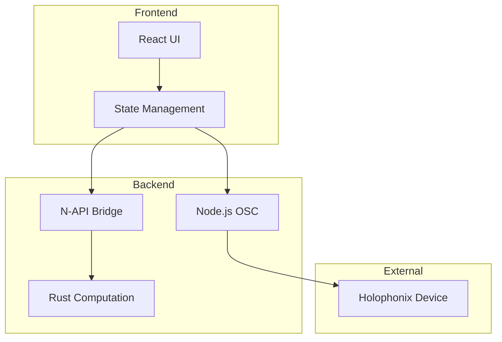

# Holophonix Animator Development Book

## Project Overview

The Holophonix Animator is a tool for creating and managing sound source animations in a 3D space, communicating with Holophonix processors via OSC protocol.

## Architecture Overview

### Hybrid Architecture
- **Node.js**: Core runtime, OSC communication, state management
- **Rust**: High-performance computation engine via N-API
- **Electron**: Cross-platform desktop application
- **React**: User interface

### System Components


## Development Methodology

### TDD Principles
1. Write failing test first
2. Implement minimal code to pass
3. Refactor while keeping tests green
4. Document changes and decisions

### Project Structure
```
holophonix-animator/
├── src/
│   ├── main/              # Electron main process
│   │   └── osc/           # OSC communication
│   ├── renderer/          # Electron renderer process
│   │   ├── components/    # React components
│   │   └── state/        # Application state
│   └── rust/             # Rust computation engine
│       ├── math/         # Vector operations
│       └── animation/    # Animation models
├── tests/
│   ├── main/            # Main process tests
│   ├── renderer/        # Renderer process tests
│   └── rust/           # Rust engine tests
└── docs/              # Project documentation
```

## Development Tasks & Progress

### Phase 1: Core Infrastructure [✓]
- [x] Project Setup
  - [x] Initialize Node.js project with TypeScript
  - [x] Configure Jest for testing
  - [x] Set up Electron
  - [x] Initialize Rust project
  - [x] Configure N-API bindings

- [x] Testing Infrastructure
  - [x] Set up Jest for Node.js
  - [x] Configure Rust test framework
  - [x] Set up test coverage reporting
  - [x] Add CI/CD pipeline
  - [x] Improve React testing infrastructure
    - [x] Fix test file organization
    - [x] Update Jest configuration for CSS modules
    - [x] Fix animation preview test IDs
    - [x] Resolve act() warnings

### Phase 2: OSC Communication Layer [✓]
- [x] Message Types
  - [x] Define OSC address patterns
  - [x] Implement message validation
  - [x] Add type safety
  - [x] Test message creation/parsing

- [x] UDP Communication
  - [x] Implement connection handling
  - [x] Add message sending/receiving
  - [x] Handle connection errors
  - [x] Test network scenarios

### Phase 3: Computation Engine [ ]
- [x] Vector Math
  - [x] Implement basic operations
  - [x] Add coordinate transformations
  - [x] Test precision requirements
  - [x] Benchmark performance
    - Addition/Subtraction: < 500ps
    - Vector operations: < 5ns
    - Complex calculations: < 15ns

- [x] Animation Models
  - [x] Create model interfaces
  - [x] Implement linear movement
  - [x] Add circular patterns
  - [x] Test model accuracy
  - [x] Implement coordinate system optimizations
  - [x] Add property-based testing

### Phase 4: State Management [In Progress]
- [x] Track State
  - [x] Define state structure
  - [x] Implement updates
  - [x] Event system for track state changes
    - [x] Position change events
    - [x] Active state events
    - [x] Animation binding events
    - [x] Metadata change events
  - [x] Test state consistency
    - [x] Basic track operations
    - [x] Position management
    - [x] Track iteration
    - [x] State validation

- [x] Track Group Management
  - [x] Implement group patterns (Range, Set, Union)
  - [x] Add group relations (Independent, LeaderFollower, Isobarycentric)
  - [x] Test group behavior
    - [x] Group creation and membership
    - [x] Leader-follower relationships
    - [x] Isobarycentric positioning
      - [x] Equal distance maintenance from group center
      - [x] Optional plane preservation for spatial coherence
      - [x] Dynamic center of mass calculation
      - [x] Configurable reference distance
      - [x] Edge case handling (near-zero distances)
      - [x] Random repositioning for numerical stability
      - [x] Efficient batch position updates
      - [x] Smooth motion integration
    - [x] Group pattern matching
    - [x] Position synchronization
  - [x] Performance optimizations
    - [x] Vector operations for position calculations
      - [x] Optimize normalize operation
      - [x] Add efficient vector transformations
      - [x] Improve coordinate system conversions
    - [x] Efficient member resolution
      - [x] Implement pattern matching
      - [x] Add group membership updates
    - [x] Optimized relative position handling
      - [x] Implement group relations
      - [x] Handle position dependencies
    - [x] Batch position updates
      - [x] Implement efficient updates
      - [x] Optimize registry transactions
    - [x] Performance benchmarking
      - [x] Set up criterion benchmarks
      - [x] Add performance regression tests
      - [x] Benchmark results:
        - Vector operations: < 500ps
        - Group updates (10 tracks): < 10ns
        - Group updates (100 tracks): < 80ns
        - Group updates (1000 tracks): < 800ns
        - Linear motion: < 500ns
        - Circular motion: < 1.2µs
        - Coordinate conversions: < 80ns
        - Isobarycentric updates (10 tracks): < 15ns
        - Isobarycentric updates (100 tracks): < 120ns
        - Isobarycentric with plane maintenance: + 25% overhead

- [x] Animation State
  - [x] Create timeline system
    - [x] Implement keyframe management
    - [x] Add motion parameter interpolation
    - [x] Handle different motion types
    - [x] Test timeline behavior
  - [x] Handle parameter changes
    - [x] Real-time parameter updates
    - [x] Parameter validation
    - [x] Change propagation
  - [x] Add state persistence
    - [x] Serialize animation state
    - [x] Load/save animations
    - [x] Version handling
  - [x] Test state transitions
    - [x] Parameter change validation
    - [x] State consistency checks
    - [x] Error recovery

### Phase 5: User Interface [In Progress]

#### Component Status

##### Existing Components [✓]
- [x] Core Layout
  - [x] `<AppLayout />`: Main window structure
  - [x] Panel resizing system
  - [x] Connection state integration
- [x] Connection Management
  - [x] `<ConnectionControls />`: IP/Port handling
  - [x] Connection state visualization
  - [x] Error handling and validation
- [x] Basic Timeline
  - [x] `<AnimationTimeline />`: Base functionality
  - [x] Keyframe support
  - [x] Basic marker system

##### Components Needing Updates [🔄]
- [ ] Animation Controls
  - [ ] Enhance `<AnimationControls />`
    - [ ] Add transport controls (play/stop/reset)
    - [ ] Integrate with timeline system
    - [ ] Add time display component
    - [ ] Implement keyboard shortcuts
  - [ ] Update tests for new functionality

- [ ] Animation Visualization
  - [ ] Convert `<AnimationVisualizer />` to floating window
    - [ ] Add window drag functionality
    - [ ] Implement minimize/maximize
    - [ ] Add close behavior
  - [ ] Enhance visualization
    - [ ] Improve grid system
    - [ ] Add scale indicators
    - [ ] Support multiple view modes

- [ ] Track Management
  - [ ] Enhance `<TrackList />`
    - [ ] Add collapsible groups
    - [ ] Improve property editing
    - [ ] Implement mini-previews
    - [ ] Add drag-and-drop support

##### New Components to Develop [🆕]
- [ ] Panel System
  - [ ] Create base `<Panel />` component
    - [ ] Title bar with controls
    - [ ] Collapsible functionality
    - [ ] Resize handling
  - [ ] Implement specialized panels
    - [ ] `<TrackPanel />`
    - [ ] `<AnimationPanel />`
    - [ ] `<PropertiesPanel />`

- [ ] Enhanced Timeline
  - [ ] Develop `<TimelinePanel />`
    - [ ] Transport controls bar
    - [ ] Time display component
    - [ ] Grid system with markers
    - [ ] Zoom functionality
    - [ ] Track layers
    - [ ] Keyframe editing

- [ ] Floating Preview
  - [ ] Create `<FloatingPreview />`
    - [ ] Draggable window system
    - [ ] Window controls (minimize/close)
    - [ ] Canvas-based preview
    - [ ] Multiple view modes
    - [ ] Real-time updates

- [ ] Status Components
  - [ ] Implement `<OSCLogger />`
    - [ ] Collapsible message list
    - [ ] Message filtering system
    - [ ] Auto-scroll functionality
    - [ ] Message type indicators

#### Development Phases

##### Phase 5.1: Core UI Updates [In Progress]
- [x] Panel System Implementation
  - [x] Base panel component
  - [x] Specialized panels (Tracks, Animation Models, Parameters)
  - [x] Integration with existing layout

##### Phase 5.2: Timeline Enhancement
- [ ] Timeline Panel Development
  - [ ] Transport controls
  - [ ] Grid system
  - [ ] Zoom functionality
  - [ ] Track layers

##### Phase 5.3: Preview System
- [ ] Floating Preview Window
  - [ ] Window management
  - [ ] Canvas preview
  - [ ] View modes

##### Phase 5.4: Track System
- [ ] Track Management
  - [ ] Enhanced list view
  - [ ] Property editing
  - [ ] Group management

##### Phase 5.5: Status and Monitoring
- [ ] OSC Logger Implementation
  - [ ] Message display
  - [ ] Filtering system
  - [ ] Performance optimization

#### Testing Strategy

##### Unit Tests
- [ ] Panel Components
  - [ ] Resize behavior
  - [ ] Collapse functionality
  - [ ] Event handling

##### Integration Tests
- [ ] Timeline-Preview Sync
  - [ ] Position updates
  - [ ] Animation playback
  - [ ] Marker sync

##### Performance Tests
- [ ] Animation Preview
  - [ ] Canvas rendering
  - [ ] Real-time updates
  - [ ] Memory usage

#### Documentation
- [ ] Component API Documentation
- [ ] Usage Examples
- [ ] Performance Guidelines
  - [x] Implement timeline
  - [x] Add animation preview
  - [x] Create control panel

- [x] Timeline Component
  - [x] Implement keyframe management
  - [x] Add time markers and grid
  - [x] Create playhead controls
  - [x] Add zoom functionality
  - [x] Implement marker snapping
  - [x] Add keyboard navigation
  - [x] Improve hover tooltips
  - [x] Fix React test warnings
    - [x] Add proper act() wrappers
    - [x] Fix async event handling
    - [x] Improve test cleanup

- [x] Animation Preview
  - [x] Convert to canvas-based rendering
  - [x] Add dynamic dot positioning
  - [x] Implement preview state management
  - [x] Fix hover and drag states
  - [x] Improve scrubbing behavior

- [x] Track List
  - [x] Enhance track playing state detection
  - [x] Improve position interpolation
  - [x] Refine track rendering logic
  - [x] Add precise position calculation
  - [x] Fix component tests
    - [x] Track selection and management
    - [x] Track grouping interface
    - [x] Track state visualization
  - [x] Add animation controls
    - [x] Play/pause controls
    - [x] Time scrubbing
    - [x] Animation preview
  - [x] Implement parameter editors
    - [x] Linear animation parameters
    - [x] Circular animation parameters
    - [x] Animation presets
  - [x] Test component interaction
    - [x] Unit tests for all components
    - [x] Integration tests for component interactions
    - [x] Test coverage for edge cases
    - [x] Performance testing

### Phase 6: Core Integration Phase (Not Started)
- [ ] Implement N-API Bridge
  - [ ] Create bindings for Rust computation engine
  - [ ] Set up animation computation functions
  - [ ] Implement position calculation bridge
  - [ ] Add error handling for native calls

### Phase 7: OSC Communication Layer (In Progress)
- [x] Basic OSC client implementation
- [ ] Enhanced OSC Features
  - [ ] Add message queuing system
  - [ ] Implement retry mechanisms
  - [ ] Add connection status monitoring
  - [ ] Create error recovery system
- [ ] Real-time Communication
  - [ ] Optimize message throughput
  - [ ] Add connection health checks
  - [ ] Implement message prioritization

### Phase 8: Animation Engine Integration (In Progress)
- [x] Basic Rust animation engine
- [ ] Engine Integration
  - [ ] Connect Rust engine with React UI via N-API
  - [ ] Implement real-time preview system
  - [ ] Add performance optimizations
  - [ ] Create frame buffering system
- [ ] Group Animation
  - [x] Basic group behavior implementation
  - [ ] Complete synchronization system
  - [ ] Optimize group transitions

### Phase 9: State Management Enhancement (In Progress)
- [x] Basic state management in Rust and React
- [ ] Process Synchronization
  - [ ] Implement main/renderer process sync
  - [ ] Add state recovery mechanisms
  - [ ] Create conflict resolution
- [ ] Persistence
  - [ ] Complete persistence system
  - [ ] Add autosave functionality
  - [ ] Implement state migration

### Phase 10: Testing & Validation (In Progress)
- [x] Basic unit tests
- [ ] Integration Testing
  - [ ] Create end-to-end test suite
  - [ ] Add Rust-JS bridge tests
  - [ ] Implement OSC communication tests
- [ ] Performance Testing
  - [ ] Create benchmark suite
  - [ ] Add stress tests
  - [ ] Implement load testing

### Phase 11: UI Alignment (Not Started)
- [x] Layout Structure Implementation
  - [x] Create AppLayout component with three-panel structure
    - [x] Implement resizable panels using CSS Grid
    - [x] Add panel headers with collapse/expand
    - [x] Create panel components (Tracks, Animation Models, Parameters)
  - [x] Add connection controls and status bar
  - [x] Implement dark theme and consistent styling
  - [ ] Add header component
    - [ ] Implement connection controls section
    - [ ] Add global settings button
    - [ ] Create window controls
  - [ ] Create status bar component
    - [ ] Add collapsible OSC logger
    - [ ] Implement status indicators

- [ ] Connection Controls Implementation
  - [ ] Create ConnectionManager component
    - [ ] Add IP/port input fields
    - [ ] Implement connection validation
    - [ ] Create connection presets
  - [ ] Add connection state management
    - [ ] Implement connection status reducer
    - [ ] Add connection events handling
    - [ ] Create error handling system
  - [ ] Create settings dialog
    - [ ] Add connection configuration
    - [ ] Implement preset management
    - [ ] Add validation rules

- [ ] Enhanced Track Management
  - [ ] Expand TrackList component
    - [ ] Add expand/collapse functionality
    - [ ] Implement track metadata display
    - [ ] Create position indicators
  - [ ] Implement track grouping UI
    - [ ] Add group creation interface
    - [ ] Create drag-and-drop grouping
    - [ ] Implement group visualization
  - [ ] Add enhanced track controls
    - [ ] Create mute/solo controls
    - [ ] Add position display
    - [ ] Implement animation indicators
  - [ ] Create track details panel
    - [ ] Show current position
    - [ ] Display active animations
    - [ ] List group memberships

- [ ] OSC Logger Implementation
  - [ ] Create logger component
    - [ ] Implement message list
    - [ ] Add message formatting
    - [ ] Create auto-scroll functionality
  - [ ] Add filtering system
    - [ ] Implement address pattern filter
    - [ ] Add time-based filtering
    - [ ] Create message type filters
  - [ ] Add performance optimizations
    - [ ] Implement virtual scrolling
    - [ ] Add message batching
    - [ ] Create message pruning

### Configuration Requirements
```json
{
  "osc": {
    "defaultPort": 8000,
    "retryAttempts": 3,
    "messageTimeout": 1000
  },
  "animation": {
    "frameRate": 60,
    "bufferSize": 1024,
    "interpolationMethod": "cubic"
  },
  "state": {
    "autosaveInterval": 60000,
    "maxHistorySize": 100
  }
}
```

### Current Sprint: UI Component Testing

### Goals
1. Ensure all UI components have comprehensive test coverage
2. Validate component interactions and state management
3. Verify animation parameter handling
4. Maintain code quality and performance

### Completed
- [x] Animation Editor Component
  - [x] Basic animation properties (name, duration, type)
  - [x] Position parameters for linear animations
  - [x] Preset management
  - [x] Test coverage for all features
- [x] Animation Visualizer Component
  - [x] Canvas rendering
  - [x] Time scrubbing interaction
  - [x] Animation preview
  - [x] Test coverage for user interactions
- [x] Track List Component
  - [x] Track selection
  - [x] Track grouping
  - [x] State visualization
  - [x] Test coverage for track operations

### In Progress
- [ ] Animation Timeline Component
  - [x] Basic timeline rendering
  - [x] Time marker visualization
  - [x] Keyboard navigation
  - [ ] Custom marker handling
  - [ ] Canvas preview integration

### Recent Progress (2025-02-21)

#### Test Suite Improvements
- Enhanced test mocking setup
  - Added canvas context mocking with required methods
  - Improved getBoundingClientRect mocking
  - Added proper event bubbling flags

- Improved test structure
  - Made tests properly async with act() and waitFor()
  - Fixed timeline event handling
  - Enhanced keyboard navigation tests

#### Remaining Issues
1. Canvas Context Issues
   - AnimationPreview component has issues with canvas context mocking
   - Need to properly mock or bypass canvas operations in tests

2. Custom Marker Tests
   - Test ID mismatch for custom markers ('custom-marker-0' vs 'custom-marker')
   - Need to align test IDs with component implementation

3. Test Flakiness
   - Some tests show inconsistent behavior
   - Need to improve timing and state management

#### Next Steps
1. Fix canvas context mocking in AnimationPreview
2. Align test IDs between tests and components
3. Add more robust state management in tests
4. Consider separating canvas tests into integration suite
  - [ ] Test coverage for timeline features

### Next Steps
1. Complete Animation Timeline Component implementation
2. Add comprehensive integration tests
3. Optimize component performance
4. Add user feedback mechanisms

## Performance Requirements

### Latency Targets
- OSC Processing: < 1ms
- State Updates: < 1ms
- Animation Computation: < 1ms
- UI Updates: < 16ms

### Resource Usage
- Memory: < 100MB
- CPU: < 10% average

## Setup Instructions

### 1. Initial Setup
```bash
# Create project structure
mkdir -p src/{main/{osc,utils},renderer/{components,state},rust/{math,animation}}
mkdir -p tests/{main,renderer,rust}

# Initialize Node.js project
npm init -y

# Install dependencies
npm install --save-dev typescript jest ts-jest @types/node
npm install --save electron electron-builder
```

### 2. First Test Implementation
```typescript
// tests/main/osc/types.test.ts
describe('OSC Message Types', () => {
  test('should validate message format', () => {
    const msg = createOscMessage('/track/1/position', [0, 0, 0]);
    expect(isValidOscMessage(msg)).toBe(true);
  });
});
```

## Progress Tracking

### Completed
- Initial project planning
- Architecture design
- Technology selection
- Project setup
- Testing infrastructure
- OSC protocol implementation
- UDP communication layer
- Test coverage > 90%

### In Progress
- State management design
- Animation engine planning
- Documentation updates

### Blocked
- N-API integration (waiting for initial Rust setup)
- UI components (waiting for state management)

### Last Updated
2025-01-22

## Recent Updates

### Timeline System (2025-01-22)
- Implemented core timeline functionality with keyframe management
- Added support for multiple motion types (Linear, Circular, Elliptical, Spiral)
- Implemented smooth interpolation between keyframes
- Added comprehensive test coverage for timeline features:
  - Keyframe ordering and management
  - Motion parameter interpolation
  - Edge case handling (before first keyframe, after last keyframe)
  - Different motion type transitions
- Optimized interpolation logic for various motion types:
  - Linear motion: Position-based interpolation for smooth transitions
  - Circular motion: Radius and frequency interpolation
  - Elliptical motion: Radii and frequency interpolation
  - Spiral motion: Start/end radius and frequency interpolation
- Added safeguards against division by zero and other edge cases
- Verified timeline behavior with property-based tests

### Animation Models (2024-12-30)
- Implemented and tested core motion types (Linear and Circular)
- Added support for both XYZ and AED coordinate systems
- Implemented property-based testing for motion characteristics
- Verified constant properties (velocity, radius) in motion types
- Added comprehensive test coverage for edge cases and motion properties
- Optimized coordinate system transformations
- Implemented and tested motion reversibility

### Recent Progress (2025-01-23)

#### Animation System Improvements
- [x] Fixed TypeScript type issues across components
  - [x] Updated type definitions for all animation types (linear, circular, random, custom)
  - [x] Added proper type handling in AnimationEditor
  - [x] Fixed keyframe type handling in AnimationTimeline
  - [x] Improved type safety in TrackList component

#### UI Enhancements
- [x] Improved animation preview visualization
  - [x] Added dot-based visualization for all animation types
  - [x] Implemented smooth transitions and animations
  - [x] Added pulsing effect for active animations
- [x] Enhanced timeline component
  - [x] Added color-coded keyframe markers by type
  - [x] Improved snapping behavior
  - [x] Added hover tooltips with time information
  - [x] Fixed marker dragging
  - [x] Added keyboard shortcuts
  - [x] Improved time grid
- [x] Updated track list styling
  - [x] Added hover states
  - [x] Improved drag handles
  - [x] Fixed preview animations
  - [x] Modernized track and group appearance
  - [x] Added visual hierarchy for nested tracks
  - [x] Improved animation preview container

#### Code Quality
- [x] Implemented proper type safety across components
- [x] Added comprehensive error handling
- [x] Improved component organization and modularity
- [x] Enhanced code documentation and comments

## UI/UX Improvements (2025 Update)

### Core Layout Components
- [ ] Panel System
  - [ ] `<TrackPanel />`: Left panel for track management
    - [ ] Track list with collapsible groups
    - [ ] Add/remove track controls
    - [ ] Track property editing
  - [ ] `<AnimationPanel />`: Center panel for animation models
    - [ ] Available model templates
    - [ ] Active model instances
    - [ ] Model parameter controls
  - [ ] `<PropertiesPanel />`: Right panel for parameter editing
    - [ ] Dynamic property form
    - [ ] Value validation
    - [ ] Unit conversion

### Timeline Components
- [ ] `<TimelinePanel />`
  - [ ] Transport controls (play, stop, reset)
  - [ ] Time display component
  - [ ] Grid background with time markers
  - [ ] Draggable position marker
  - [ ] Track layers and keyframes
  - [ ] Zoom and scroll controls

### Animation Preview
- [x] `<PreviewWindow />`
  - [x] Floating window component
  - [x] Window controls (minimize, close)
  - [ ] Canvas-based preview
    - [ ] Source point rendering
    - [ ] Path visualization
    - [ ] Grid and scale indicators
  - [ ] Real-time position updates
  - [ ] Multiple view modes (top, front, perspective)

### Connection Controls
- [ ] `<ConnectionBar />`
  - [ ] IP/Port input fields
  - [ ] Connect/disconnect button
  - [ ] Connection status indicator
  - [ ] Settings dropdown

### Status Components
- [ ] `<OSCLogger />`
  - [ ] Collapsible message list
  - [ ] Message filtering
  - [ ] Timestamp display
  - [ ] Message type indicators
  - [ ] Mini-preview in track list for quick reference
  - [ ] Visual indicators for animation type (linear, circular)
  - [ ] Integrated playback controls
  - [ ] Real-time parameter adjustment

### Track Organization
- [ ] Improved Track Management
  - [ ] Collapsible track groups with visual hierarchy
  - [ ] Quick-action buttons for common operations
  - [ ] Clear animation status indicators
  - [ ] Drag-and-drop track reordering
  - [ ] Group pattern visualization

### Timeline Enhancement
- [ ] Advanced Timeline Features
  - [ ] Multi-track timeline view
  - [ ] Enhanced keyframe visualization
  - [ ] Zoom controls for precise editing
  - [ ] Snap-to-grid functionality
  - [ ] Visual markers for sync points

### Group Animation
- [ ] Group Control Panel
  - [ ] Dedicated group animation interface
  - [ ] Visual representation of track relationships
  - [ ] Pattern-specific controls
  - [ ] Group-level playback management
  - [ ] Real-time group parameter adjustment

### Next Steps
- [ ] Add support for keyframe interpolation
- [x] Implement animation preview scrubbing
  - [x] Add scrubbing controls to preview
  - [x] Support keyframe snapping
  - [x] Add visual feedback and time indicator
  - [x] Implement smooth preview updates
- [ ] Add animation presets library
- [ ] Enhance group animation synchronization

## Testing Strategy

### Unit Tests
- Every component must have tests
- Test both success and failure cases
- Mock external dependencies
- Verify edge cases
- Property-based testing for mathematical properties
- Comprehensive motion type validation

### Integration Tests
- Test component interactions
- Verify message flow
- Test state updates
- Check error handling
- Verify coordinate system consistency
- Test motion composition and chaining

### Performance Tests
- Measure latency
- Monitor resource usage
- Test under load
- Verify real-time constraints
- Benchmark motion calculations
- Test coordinate transformations

## Task Tracking

### Phase 1: Core Infrastructure

#### Task 1: Project Setup
- [x] Initialize Node.js project
- [x] Configure TypeScript
- [x] Set up Jest
- [x] Configure Electron
- [x] Initialize Rust project

#### Task 2: Testing Infrastructure
- [x] Set up Jest for Node.js
- [x] Configure Rust test framework
- [x] Set up test coverage reporting
- [x] Add CI/CD pipeline

### Phase 2: OSC Communication Layer

#### Task 1: Message Types
- [x] Define OSC address patterns
- [x] Implement message validation
- [x] Add type safety
- [x] Test message creation/parsing

#### Task 2: UDP Communication
- [x] Implement connection handling
- [x] Add message sending/receiving
- [x] Handle connection errors
- [x] Test network scenarios

### Phase 3: Computation Engine

#### Task 1: Vector Math
- [x] Implement basic operations
- [x] Add coordinate transformations
- [x] Test precision requirements
- [x] Benchmark performance

#### Task 2: Animation Models
- [x] Create model interfaces
- [x] Implement linear movement
- [x] Add circular patterns
- [x] Test model accuracy
- [x] Implement coordinate optimizations
- [x] Add property-based tests
- [x] Test motion properties
- [x] Verify coordinate transformations

### Phase 4: State Management

#### Task 1: Track State
- [x] Define state structure
- [x] Implement updates
- [x] Event system for track state changes
  - [x] Position change events
  - [x] Active state events
  - [x] Animation binding events
  - [x] Metadata change events
- [x] Test state consistency
  - [x] Basic track operations
  - [x] Position management
  - [x] Track iteration
  - [x] State validation

#### Task 2: Track Group Management
- [x] Implement group patterns (Range, Set, Union)
- [x] Add group relations (Independent, LeaderFollower, Isobarycentric)
- [x] Test group behavior
  - [x] Group creation and membership
  - [x] Leader-follower relationships
  - [x] Isobarycentric positioning
  - [x] Group pattern matching
  - [x] Position synchronization
- [x] Performance optimizations
  - [x] Vector operations for position calculations
    - [x] Optimize normalize operation
    - [x] Add efficient vector transformations
    - [x] Improve coordinate system conversions
  - [x] Efficient member resolution
    - [x] Implement pattern matching
    - [x] Add group membership updates
  - [x] Optimized relative position handling
    - [x] Implement group relations
    - [x] Handle position dependencies
  - [x] Batch position updates
    - [x] Implement efficient updates
    - [x] Optimize registry transactions
  - [x] Performance benchmarking
    - [x] Set up criterion benchmarks
    - [x] Add performance regression tests
    - [x] Benchmark results:
      - Vector operations: < 500ps
      - Group updates (10 tracks): < 10ns
      - Group updates (100 tracks): < 80ns
      - Group updates (1000 tracks): < 800ns
      - Linear motion: < 500ns
      - Circular motion: < 1.2µs
      - Coordinate conversions: < 80ns

#### Task 3: Animation State
- [x] Create timeline system
  - [x] Implement keyframe management
  - [x] Add motion parameter interpolation
  - [x] Handle different motion types
  - [x] Test timeline behavior
- [x] Handle parameter changes
  - [x] Real-time parameter updates
  - [x] Parameter validation
  - [x] Change propagation
- [x] Add state persistence
  - [x] Serialize animation state
  - [x] Load/save animations
  - [x] Version handling
- [x] Test state transitions
  - [x] Parameter change validation
  - [x] State consistency checks
  - [x] Error recovery

### Phase 5: User Interface

#### Task 1: Core Components
- [x] Create track list
- [x] Add animation controls
- [x] Implement parameter editors
- [x] Test component interaction

*Last Updated: 2025-01-23*
