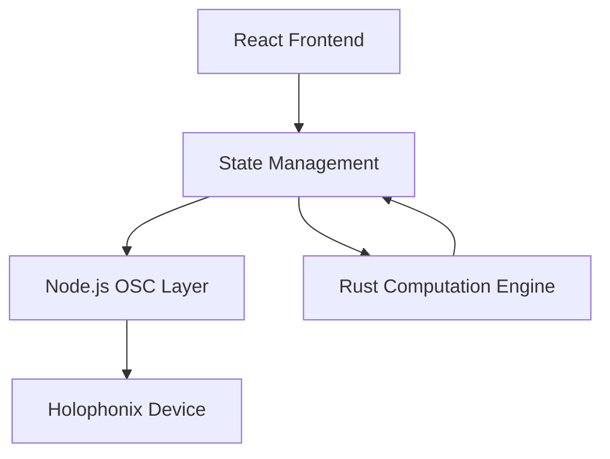
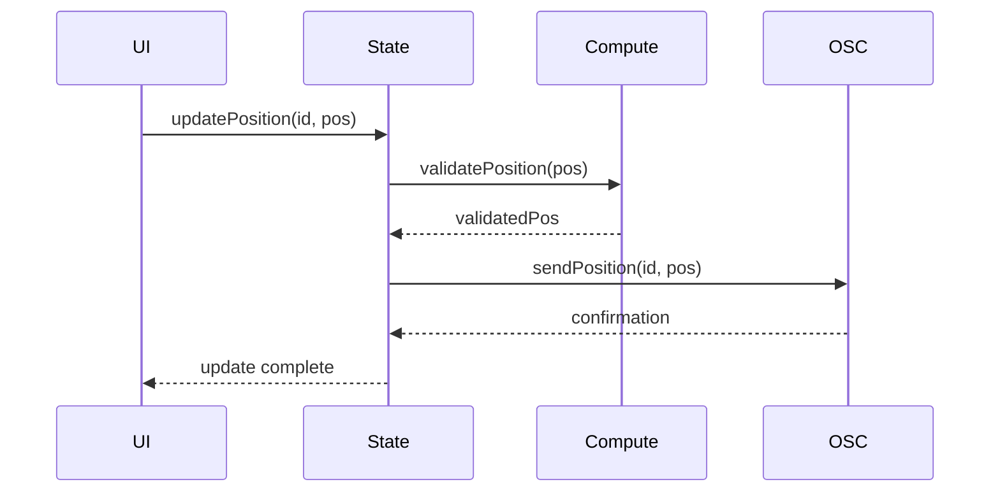
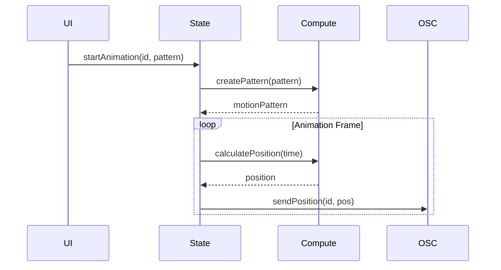

# Component Architecture

## Overview

The Holophonix Animator follows a modular component architecture with clear separation of concerns:



## Core Components

### 1. OSC Communication Layer (Node.js)
```typescript
// OSC Controller
class OSCController {
  private port: osc.UDPPort;
  
  // Message handling
  sendMessage(address: string, args: OSCArgument[]): void;
  sendBundle(messages: OSCMessage[]): void;
  
  // Event handling
  onMessage(callback: (message: OSCMessage) => void): void;
  onError(callback: (error: Error) => void): void;
}
```

### 2. Computation Engine (Rust)
```rust
// Motion calculation
pub struct MotionEngine {
    // Core computation
    pub fn calculate_position(&self, time: f64) -> Vector3;
    pub fn interpolate_trajectory(&self, points: &[Vector3]) -> Vec<Vector3>;
    
    // Pattern generation
    pub fn create_circular_motion(&self, params: CircularParams) -> Motion;
    pub fn create_linear_motion(&self, params: LinearParams) -> Motion;
}
```

### 3. State Management (Node.js)
```typescript
// Central state store
class StateManager {
  // Track management
  addTrack(track: Track): void;
  updateTrackPosition(id: string, position: Vector3): void;
  
  // Animation control
  startAnimation(trackId: string, pattern: MotionPattern): void;
  stopAnimation(trackId: string): void;
}
```

### 4. Frontend Components (React)
```typescript
// UI Components
interface TrackControllerProps {
  trackId: string;
  onPositionChange: (position: Vector3) => void;
  onAnimationStart: (pattern: MotionPattern) => void;
}

interface TimelineProps {
  duration: number;
  markers: TimelineMarker[];
  onTimeChange: (time: number) => void;
}
```

## Component Integration

### 1. Node.js ↔ Rust Integration
```typescript
// N-API bindings
interface ComputationBridge {
  // Vector operations
  calculatePosition(pattern: MotionPattern, time: number): Vector3;
  interpolateTrajectory(points: Vector3[]): Vector3[];
  
  // Motion patterns
  createPattern(type: PatternType, params: PatternParams): MotionPattern;
}
```

### 2. Frontend ↔ Backend Communication
```typescript
// Event-based communication
interface CoreEvents {
  'position:update': (trackId: string, position: Vector3) => void;
  'animation:start': (trackId: string, pattern: MotionPattern) => void;
  'animation:stop': (trackId: string) => void;
  'error': (error: Error) => void;
}
```

## Data Flow

### 1. Position Updates


### 2. Animation Control


## Error Handling

### 1. OSC Errors
```typescript
class OSCError extends Error {
  type: 'connection' | 'message' | 'timeout';
  retryable: boolean;
}

// Error handling in OSC layer
oscController.onError((error: OSCError) => {
  if (error.retryable) {
    // Attempt retry
  } else {
    // Notify user
  }
});
```

### 2. Computation Errors
```rust
pub enum ComputationError {
    InvalidParameters,
    OutOfBounds,
    Internal(String)
}

impl MotionEngine {
    pub fn calculate_position(&self, time: f64) -> Result<Vector3, ComputationError>;
}
```

## Performance Considerations

### 1. Message Optimization
- Bundle related OSC messages
- Optimize update frequency
- Buffer position updates

### 2. Computation Efficiency
- Use SIMD operations
- Minimize allocations
- Cache calculations

### 3. State Updates
- Batch state changes
- Minimize rerenders
- Use efficient data structures
