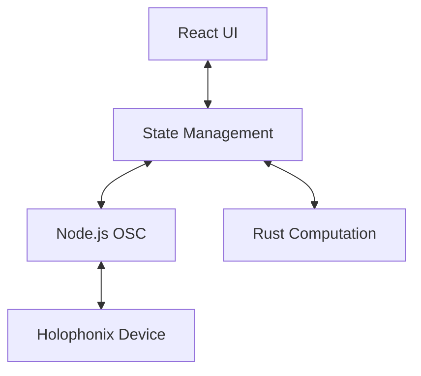

# Inter-Component Communication

## Overview

The Holophonix Animator uses a layered communication architecture:



## Communication Layers

### 1. UI ↔ State Management
```typescript
// Event-based communication
interface UIEvents {
  'position:change': (update: PositionUpdate) => void;
  'animation:start': (control: AnimationControl) => void;
  'animation:stop': (trackId: string) => void;
}

// State subscription
interface StateSubscription {
  subscribe<K extends keyof AppState>(
    key: K,
    callback: (value: AppState[K]) => void
  ): () => void;
}
```

### 2. State ↔ OSC
```typescript
// OSC message handling
interface OSCController {
  // Send messages
  sendMessage(address: string, args: OSCArgument[]): Promise<void>;
  sendBundle(messages: OSCMessage[]): Promise<void>;
  
  // Receive messages
  onMessage(callback: (message: OSCMessage) => void): void;
  onError(callback: (error: OSCError) => void): void;
}
```

### 3. State ↔ Computation
```typescript
// N-API bindings
interface ComputationBridge {
  // Vector operations
  calculatePosition(pattern: MotionPattern, time: number): Vector3;
  interpolateTrajectory(points: Vector3[]): Vector3[];
  
  // Pattern creation
  createPattern(type: PatternType, params: PatternParams): MotionPattern;
}
```

## Message Types

### 1. Position Updates
```typescript
interface PositionUpdate {
  trackId: string;
  position: Vector3;
  timestamp: number;
}

// UI to State
ui.emit('position:change', {
  trackId: '1',
  position: { x: 1, y: 2, z: 3 },
  timestamp: Date.now()
});

// State to OSC
osc.sendMessage('/track/1/xyz', [
  { type: 'f', value: 1 },
  { type: 'f', value: 2 },
  { type: 'f', value: 3 }
]);
```

### 2. Animation Control
```typescript
interface AnimationControl {
  trackId: string;
  pattern: MotionPattern;
  parameters: Record<string, number>;
}

// UI to State
ui.emit('animation:start', {
  trackId: '1',
  pattern: 'circular',
  parameters: { radius: 2, speed: 1 }
});

// State to Computation
const pattern = compute.createPattern('circular', {
  radius: 2,
  speed: 1
});
```

## Performance Optimization

### 1. Message Batching
```typescript
// Batch OSC messages
interface OSCBundle {
  timeTag: number;
  packets: OSCMessage[];
}

osc.sendBundle({
  timeTag: osc.timeTag(0),
  packets: [
    { address: '/track/1/xyz', args: [1, 2, 3] },
    { address: '/track/1/gain', args: [0.8] }
  ]
});
```

### 2. State Updates
```typescript
// Batch state updates
interface StateUpdate {
  type: string;
  payload: any;
}

state.batchUpdate([
  { type: 'position', payload: position },
  { type: 'animation', payload: animation }
]);
```

## Error Handling

### 1. Communication Errors
```typescript
// Error handling in OSC layer
try {
  await osc.sendMessage(address, args);
} catch (error) {
  if (error instanceof OSCError) {
    if (error.retryable) {
      await retry(() => osc.sendMessage(address, args));
    } else {
      notifyUser('Communication Error', error.message);
    }
  }
}
```

### 2. Computation Errors
```typescript
// Error handling in computation
try {
  const position = compute.calculatePosition(pattern, time);
} catch (error) {
  if (error instanceof ComputationError) {
    // Handle computation error
    logger.error('Computation failed', error);
    notifyUser('Calculation Error', error.message);
  }
}
```

## Monitoring

### 1. Performance Metrics
```typescript
interface CommunicationMetrics {
  messageLatency: number;
  messageCount: number;
  errorCount: number;
  retryCount: number;
}

class MetricsCollector {
  recordMetric(key: keyof CommunicationMetrics, value: number): void;
  getMetrics(): CommunicationMetrics;
}
```

### 2. Debug Logging
```typescript
const logger = new Logger({
  levels: ['debug', 'info', 'warn', 'error'],
  context: {
    component: 'communication',
    version: '1.0.0'
  }
});

logger.debug('Message sent', {
  address: '/track/1/xyz',
  args: [1, 2, 3],
  latency: 5
});
```

## Best Practices

### 1. Message Design
- Use typed messages
- Include timestamps
- Validate payloads
- Handle versioning

### 2. Error Recovery
- Implement retries
- Use fallbacks
- Handle timeouts
- Maintain state

### 3. Performance
- Batch updates
- Minimize latency
- Monitor metrics
- Optimize payloads
