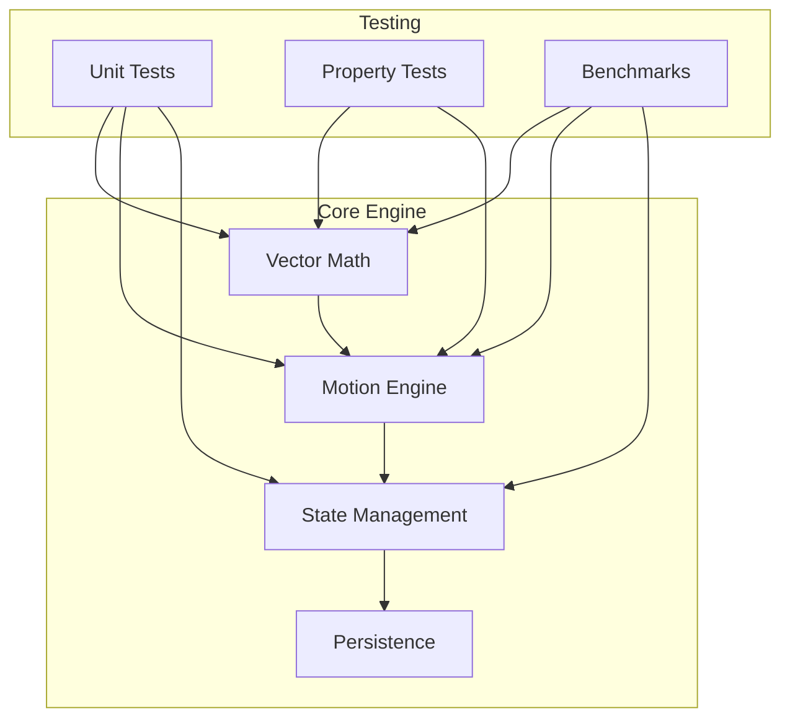

# System Design

## Overview

The Holophonix Animator is built as a high-performance Rust computation engine for managing sound source animations in 3D space. The system follows a Test-Driven Development (TDD) approach to ensure reliability and maintainability.

## Core Architecture

## Key Components

### Vector Math Engine
- Efficient 3D vector operations
- Coordinate system transformations (Cartesian ↔ Spherical)
- Optimized for real-time calculations

### Motion Engine
- Linear and circular motion patterns
- Parameter interpolation
- Group movement coordination

### State Management
- Track state persistence
- Group relationships
- Animation timeline management

### Testing Infrastructure
- Comprehensive unit tests
- Property-based testing for mathematical operations
- Performance benchmarks for critical paths

## Performance Characteristics

| Operation | Performance Target | Current Achievement |
|-----------|-------------------|---------------------|
| Vector operations | < 500ps | ✓ |
| Group updates (1000 tracks) | < 1µs | ✓ |
| Motion calculations | < 1.2µs | ✓ |
| Coordinate conversions | < 80ns | ✓ |
