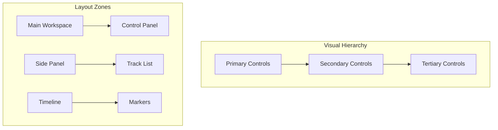

# UI/UX Design Guidelines

## Overview

The Holophonix Animator follows a modern, professional design system focused on real-time control and visualization:



## Design System

### 1. Color Palette
```typescript
// Theme tokens
const theme = {
  colors: {
    primary: {
      main: '#007AFF',
      light: '#4DA2FF',
      dark: '#0055B3'
    },
    secondary: {
      main: '#FF9500',
      light: '#FFB44D',
      dark: '#B36800'
    },
    error: {
      main: '#FF3B30',
      light: '#FF7A73',
      dark: '#B32921'
    },
    background: {
      primary: '#FFFFFF',
      secondary: '#F2F2F7',
      tertiary: '#E5E5EA'
    },
    text: {
      primary: '#000000',
      secondary: '#3C3C43',
      tertiary: '#787880'
    }
  },
  spacing: {
    xs: '4px',
    sm: '8px',
    md: '16px',
    lg: '24px',
    xl: '32px'
  }
};
```

### 2. Typography
```typescript
const typography = {
  fontFamily: {
    primary: 'Inter, system-ui, sans-serif',
    monospace: 'JetBrains Mono, monospace'
  },
  fontSize: {
    xs: '12px',
    sm: '14px',
    md: '16px',
    lg: '20px',
    xl: '24px'
  },
  fontWeight: {
    regular: 400,
    medium: 500,
    semibold: 600,
    bold: 700
  }
};
```

## Component Guidelines

### 1. Buttons
```typescript
interface ButtonProps {
  variant: 'primary' | 'secondary' | 'tertiary';
  size: 'small' | 'medium' | 'large';
  icon?: React.ReactNode;
  loading?: boolean;
}

const Button = styled.button<ButtonProps>`
  display: inline-flex;
  align-items: center;
  justify-content: center;
  border-radius: 8px;
  font-weight: ${props => props.theme.fontWeight.medium};
  transition: all 0.2s ease;
  
  ${props => props.variant === 'primary' && css`
    background: ${props.theme.colors.primary.main};
    color: white;
    
    &:hover {
      background: ${props.theme.colors.primary.dark};
    }
  `}
`;
```

### 2. Input Controls
```typescript
interface SliderProps {
  min: number;
  max: number;
  step: number;
  value: number;
  onChange: (value: number) => void;
}

const Slider = styled.input.attrs({ type: 'range' })<SliderProps>`
  width: 100%;
  height: 4px;
  background: ${props => props.theme.colors.background.tertiary};
  border-radius: 2px;
  outline: none;
  
  &::-webkit-slider-thumb {
    width: 16px;
    height: 16px;
    background: ${props => props.theme.colors.primary.main};
    border-radius: 50%;
    cursor: pointer;
    transition: transform 0.2s ease;
    
    &:hover {
      transform: scale(1.1);
    }
  }
`;
```

## Layout Patterns

### 1. Grid System
```typescript
const Grid = styled.div<{ columns: number; gap: string }>`
  display: grid;
  grid-template-columns: repeat(${props => props.columns}, 1fr);
  gap: ${props => props.gap};
  padding: ${props => props.theme.spacing.md};
`;

const Panel = styled.div`
  background: ${props => props.theme.colors.background.secondary};
  border-radius: 12px;
  padding: ${props => props.theme.spacing.md};
  box-shadow: 0 2px 8px rgba(0, 0, 0, 0.1);
`;
```

### 2. Responsive Design
```typescript
const breakpoints = {
  sm: '640px',
  md: '768px',
  lg: '1024px',
  xl: '1280px'
};

const media = {
  sm: `@media (min-width: ${breakpoints.sm})`,
  md: `@media (min-width: ${breakpoints.md})`,
  lg: `@media (min-width: ${breakpoints.lg})`,
  xl: `@media (min-width: ${breakpoints.xl})`
};
```

## Animation Guidelines

### 1. Motion Principles
```typescript
const transitions = {
  default: 'all 0.2s ease',
  smooth: 'all 0.3s cubic-bezier(0.4, 0, 0.2, 1)',
  spring: 'all 0.6s cubic-bezier(0.34, 1.56, 0.64, 1)'
};

const AnimatedComponent = styled.div`
  transition: ${transitions.smooth};
  
  &:hover {
    transform: translateY(-2px);
  }
  
  &:active {
    transform: translateY(0);
  }
`;
```

### 2. Loading States
```typescript
const LoadingSpinner = styled.div`
  width: 24px;
  height: 24px;
  border: 2px solid ${props => props.theme.colors.background.tertiary};
  border-top-color: ${props => props.theme.colors.primary.main};
  border-radius: 50%;
  animation: spin 1s linear infinite;
  
  @keyframes spin {
    to {
      transform: rotate(360deg);
    }
  }
`;
```

## Accessibility

### 1. Focus Management
```typescript
const FocusableElement = styled.div`
  &:focus-visible {
    outline: 2px solid ${props => props.theme.colors.primary.main};
    outline-offset: 2px;
  }
  
  &:focus:not(:focus-visible) {
    outline: none;
  }
`;
```

### 2. Color Contrast
```typescript
const ensureContrast = (background: string, text: string) => {
  const contrast = calculateContrastRatio(background, text);
  return contrast >= 4.5; // WCAG AA standard
};

const AccessibleText = styled.span<{ background: string }>`
  color: ${props => 
    ensureContrast(props.background, props.theme.colors.text.primary)
      ? props.theme.colors.text.primary
      : props.theme.colors.text.secondary
  };
`;
```

## Dark Mode Support

### 1. Theme Switching
```typescript
const darkTheme = {
  colors: {
    background: {
      primary: '#000000',
      secondary: '#1C1C1E',
      tertiary: '#2C2C2E'
    },
    text: {
      primary: '#FFFFFF',
      secondary: '#EBEBF5',
      tertiary: '#EBEBF599'
    }
  }
};

const ThemeProvider: React.FC = ({ children }) => {
  const [isDark, setIsDark] = useState(false);
  
  return (
    <StyledThemeProvider theme={isDark ? darkTheme : theme}>
      {children}
    </StyledThemeProvider>
  );
};
```

### 2. Dark Mode Detection
```typescript
const useDarkMode = () => {
  const [isDark, setIsDark] = useState(
    window.matchMedia('(prefers-color-scheme: dark)').matches
  );
  
  useEffect(() => {
    const mediaQuery = window.matchMedia('(prefers-color-scheme: dark)');
    const handler = (e: MediaQueryListEvent) => setIsDark(e.matches);
    
    mediaQuery.addListener(handler);
    return () => mediaQuery.removeListener(handler);
  }, []);
  
  return isDark;
};
```

## Interface Layout
```
┌─────────────────────────────────────────────────────────────────┐
│ Connection Panel: IP, Port, Status, Health                      │
├───────────────┬───────────────────────┬─────────────────────────┤
│               │                       │                         │
│ Track List    │  Animation Models     │  Parameters Panel      │
│               │                       │                         │
│ [+ Track]     │  [Select Model ▼]     │  Parameter Controls    │
│ [+ Group]     │                       │  • Faders              │
│               │  • Linear             │  • Input Fields        │
│ • Track 1     │  • Circular          │  • Checkboxes          │
│ ▼ Group 1     │  • Random            │  • Dropdowns           │
│   • Track 2   │  • Custom            │                         │
│   • Track 3   │                       │                         │
│               │  [Add Animation]      │                         │
│               │                       │                         │
│               │  Applied Animations   │                         │
│               │  • Linear Move [▶]    │                         │
│               │  • Circular [▶]       │                         │
│               │                       │                         │
└───────────────┴───────────────────────┴─────────────────────────┘
```

## User Workflow

### 1. Connection Setup
```
┌─ Connection Panel ─────────────────────┐
│ Remote IP: [192.168.1.100          ]  │
│ Remote Port: [8000  ]                 │
│ Local IP: [192.168.1.10           ]   │
│ [Connect] Status: Disconnected        │
│ Health: [OK]                          │
└─────────────────────────────────────────┘
```

### 2. Track Management
```
┌─ Tracks ──────────┐
│ [+ Add Track    ] │
│ [+ Add Group    ] │
│                   │
│ • Track 1        │
│ ▼ Group 1        │
│   • Track 2      │
│   • Track 3      │
└───────────────────┘
```

### 3. Animation Selection
```
┌─ Animation Model ─┐
│ [Select Model ▼] │
│                  │
│ • Linear        │
│ • Circular      │
│ • Random        │
│ • Custom Path   │
│ • Pattern       │
│ • Formation     │
└──────────────────┘
```

### 4. Parameter Configuration
```
┌─ Linear Movement Parameters ─┐
│ Start Position              │
│ X: [   0.5   ] or [──○──]  │
│ Y: [  -0.3   ] or [──○──]  │
│ Z: [   0.0   ] or [──○──]  │
│                            │
│ End Position               │
│ X: [  -0.5   ] or [──○──]  │
│ Y: [   0.3   ] or [──○──]  │
│ Z: [   0.0   ] or [──○──]  │
│                            │
│ Duration: [5.0] or [──○──] │
│ [✓] Loop Mode              │
│ Easing: [Linear]          │
└────────────────────────────┘
```

### 5. Applied Animations
```
┌─ Applied Animations ────────────────┐
│ Track 1                            │
│ • Linear Move [▶] [⚙] [✕]         │
│   Duration: 5.0s                   │
│                                    │
│ Group 1                            │
│ • Circular [▶] [⚙] [✕]            │
│   Speed: 0.5 rad/s                 │
└────────────────────────────────────┘
```

## Interaction Guidelines

### 1. Track Selection
- Single click to select track/group
- Double click to rename
- Drag and drop for group organization

### 2. Parameter Adjustment
- Multiple input methods based on parameter type:
  - Numerical values: Input fields and/or faders
  - Boolean values: Checkboxes or toggle buttons
  - Options: Dropdown menus
  - Coordinates: Input fields with optional fader control
- Real-time updates for all input methods
- Parameter validation and bounds checking
- Visual feedback for changes

### 3. Animation Control
- Play/Pause individual animations
- Quick access to common parameters
- Visual feedback for active animations
- Parameter presets support

### 4. Error Handling
- Clear error messages in status bar
- Visual indicators for invalid values
- Connection status feedback
- Parameter validation feedback

### 5. Internationalization
- Language selector in settings
- Localized UI elements and labels
- RTL/LTR layout support
- Localized number formats

## Keyboard Shortcuts
- `Ctrl+N`: New Track
- `Ctrl+G`: New Group
- `Delete`: Remove selected track/animation
- `Space`: Play/Pause selected animation
- `Esc`: Cancel current operation

## Visual Feedback
- Connection status colors:
  - Green: Connected
  - Red: Disconnected
  - Yellow: Connecting
- Parameter validation:
  - Red outline for invalid values
  - Yellow for warnings
  - Green for confirmed changes
- Animation status:
  - Blue: Playing
  - Gray: Paused
  - Red: Error
- Parameter input:
  - Bounds indication where applicable
  - Unit display where applicable
  - Visual feedback for changes
  - Clear indication of current value
