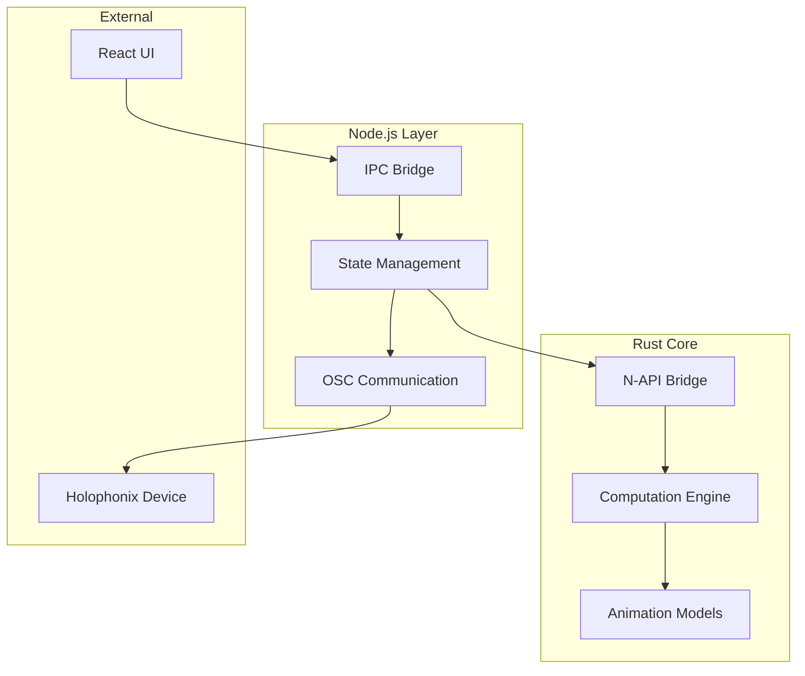

# Rust Core Architecture

## Overview

The Rust core is the high-performance computation engine of the Holophonix Animator, working in conjunction with Node.js for OSC communication and state management.



## Core Components

### 1. Computation Engine

The computation engine provides high-performance, deterministic calculations for spatial audio animations:

```rust
pub struct MotionEngine {
    // Core computation
    pub fn calculate_position(&self, time: f64) -> Result<Vector3, ComputationError>;
    pub fn interpolate_trajectory(&self, points: &[Vector3]) -> Result<Vec<Vector3>, ComputationError>;
    
    // Pattern generation
    pub fn create_circular_motion(&self, params: CircularParams) -> Result<Motion, ComputationError>;
    pub fn create_linear_motion(&self, params: LinearParams) -> Result<Motion, ComputationError>;
    
    // Group operations
    pub fn calculate_group_positions(&self, group: &Group) -> Result<Vec<Vector3>, ComputationError>;
    pub fn maintain_formation(&self, center: Vector3, members: &[Vector3]) -> Result<Vec<Vector3>, ComputationError>;
}

#[derive(Debug)]
pub enum ComputationError {
    InvalidParameter {
        name: String,
        value: String,
        reason: String,
    },
    OutOfBounds {
        value: f64,
        min: f64,
        max: f64,
    },
    ResourceExhausted {
        resource: String,
        limit: u64,
    },
    Internal(String),
}
```

### 2. Animation Models

The animation models define movement patterns and behaviors:

```rust
pub trait AnimationModel {
    // Core behavior
    fn calculate_position(&self, time: f64) -> Result<Vector3, ModelError>;
    fn update_parameters(&mut self, params: ModelParams) -> Result<(), ModelError>;
    
    // State management
    fn get_state(&self) -> ModelState;
    fn reset(&mut self) -> Result<(), ModelError>;
    
    // Group support
    fn supports_groups(&self) -> bool;
    fn calculate_group_positions(&self, group: &Group) -> Result<Vec<Vector3>, ModelError>;
}

pub struct LinearMotion {
    start: Vector3,
    end: Vector3,
    duration: f64,
    easing: EasingFunction,
}

pub struct CircularMotion {
    center: Vector3,
    radius: f64,
    speed: f64,
    direction: RotationDirection,
}

pub struct PatternMotion {
    pattern: Pattern,
    scale: f64,
    speed: f64,
    rotation: Quaternion,
}
```

### 3. Node.js Bridge

The N-API bridge enables efficient communication between Rust and Node.js:

```rust
#[napi]
pub struct Bridge {
    engine: Arc<MotionEngine>,
    state: Arc<RwLock<State>>,
}

#[napi]
impl Bridge {
    #[napi]
    pub async fn calculate_position(
        &self,
        pattern: PatternInput,
        time: f64
    ) -> Result<Position, Error> {
        self.engine
            .calculate_position(pattern.into(), time)
            .map(Position::from)
            .map_err(Error::from)
    }
    
    #[napi]
    pub async fn update_state(
        &self,
        update: StateUpdate
    ) -> Result<(), Error> {
        let mut state = self.state.write().await;
        state.apply_update(update)
            .map_err(Error::from)
    }
}

#[napi]
#[derive(Debug)]
pub struct Error {
    pub code: String,
    pub message: String,
    pub recoverable: bool,
}
```

### 4. Performance Optimization

The Rust core implements several optimization strategies:

```rust
// SIMD Operations
#[cfg(target_arch = "x86_64")]
pub use std::arch::x86_64::*;

impl MotionEngine {
    #[cfg(target_feature = "avx2")]
    pub fn calculate_positions_simd(
        &self,
        patterns: &[Pattern],
        time: f64
    ) -> Vec<Vector3> {
        // AVX2 optimized batch calculation
    }
}

// Lock-free Operations
pub struct LockFreeState {
    positions: Arc<ConcurrentHashMap<TrackId, Vector3>>,
    parameters: Arc<ConcurrentHashMap<TrackId, Parameters>>,
}

// Memory Pool
pub struct MemoryPool<T> {
    pool: ArrayQueue<T>,
    capacity: usize,
}

impl<T> MemoryPool<T> {
    pub fn acquire(&self) -> Option<T> {
        self.pool.pop()
    }
    
    pub fn release(&self, item: T) {
        let _ = self.pool.push(item);
    }
}
```

## Error Handling

The Rust core provides comprehensive error handling:

```rust
#[derive(Debug)]
pub enum CoreError {
    Computation(ComputationError),
    Model(ModelError),
    State(StateError),
    Bridge(BridgeError),
}

impl CoreError {
    pub fn is_recoverable(&self) -> bool {
        match self {
            CoreError::Computation(e) => e.is_recoverable(),
            CoreError::Model(e) => e.is_recoverable(),
            CoreError::State(e) => e.is_recoverable(),
            CoreError::Bridge(e) => e.is_recoverable(),
        }
    }
    
    pub fn handle(&self) -> Result<Recovery, CoreError> {
        match self {
            CoreError::Computation(e) => {
                // Handle computation errors
                match e {
                    ComputationError::OutOfBounds { value, min, max } => {
                        Ok(Recovery::Clamp(*value, *min, *max))
                    }
                    _ => Err(CoreError::Computation(*e)),
                }
            }
            // Handle other error types...
        }
    }
}
```

## Performance Monitoring

The Rust core includes performance monitoring capabilities:

```rust
pub struct Metrics {
    computation_time: HistogramTimer,
    memory_usage: Gauge,
    error_count: Counter,
    operation_count: Counter,
}

impl Metrics {
    pub fn record_computation(&self, duration: Duration) {
        self.computation_time.record(duration);
    }
    
    pub fn record_memory(&self, bytes: u64) {
        self.memory_usage.set(bytes as f64);
    }
    
    pub fn record_error(&self) {
        self.error_count.inc();
    }
}
