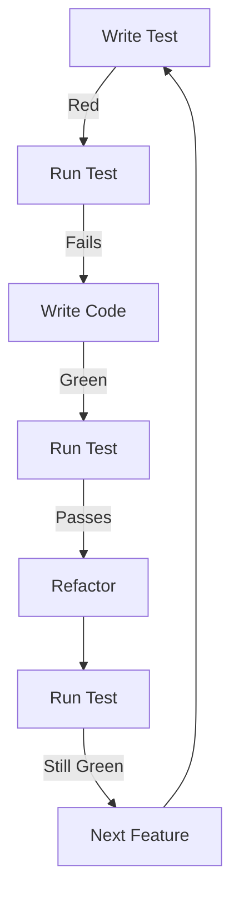

# TDD Workflow

## Development Cycle

### 1. Feature Planning
- Create test plan
- Define acceptance criteria
- Break down into testable units

### 2. Implementation


### 3. Code Review
- Check test coverage
- Review benchmark results
- Verify documentation

## Working with Tests

### Running Tests
```bash
# Run all tests
cargo test

# Run specific test
cargo test test_name

# Run with print output
cargo test -- --nocapture

# Run benchmarks
cargo bench
```

### Test Organization

```
tests/
├── unit/               # Unit tests
│   ├── math/          # Vector operations
│   ├── motion/        # Motion patterns
│   └── state/         # State management
├── property/          # Property-based tests
└── benchmarks/        # Performance tests
```

## Best Practices

### Writing Tests
1. Start with interface
2. Write minimal failing test
3. Implement minimal solution
4. Refactor
5. Add edge cases

### Test Structure
```rust
#[cfg(test)]
mod tests {
    use super::*;

    #[test]
    fn test_feature() {
        // Arrange
        let input = setup_test_data();

        // Act
        let result = perform_operation(input);

        // Assert
        assert_eq!(result, expected_output);
    }
}
```

### Benchmarking
1. Define baseline
2. Add performance test
3. Optimize
4. Verify no regressions

## Documentation

### Test Documentation
- Purpose of test
- Input/output examples
- Edge cases covered
- Performance requirements

### Code Documentation
```rust
/// Normalizes a 3D vector
///
/// # Arguments
/// * `self` - Vector to normalize
///
/// # Returns
/// * `Vector3` - Normalized vector
///
/// # Panics
/// * When vector magnitude is zero
///
/// # Examples
/// ```
/// let v = Vector3::new(1.0, 2.0, 2.0);
/// let normalized = v.normalize();
/// assert_eq!(normalized.magnitude(), 1.0);
/// ```
pub fn normalize(self) -> Vector3 {
    // Implementation
}
```
