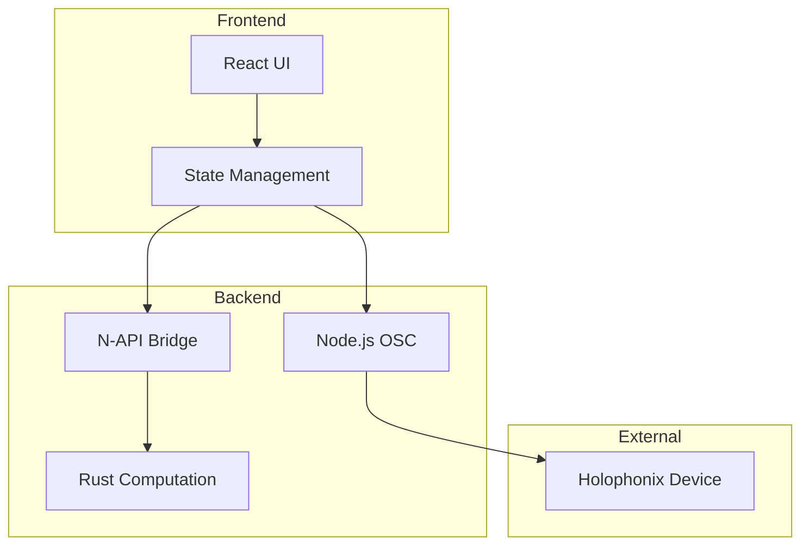

# Holophonix Animator Development Book

## Project Overview

The Holophonix Animator is a tool for creating and managing sound source animations in a 3D space, communicating with Holophonix processors via OSC protocol.

## Architecture Overview

### Hybrid Architecture
- **Node.js**: Core runtime, OSC communication, state management
- **Rust**: High-performance computation engine via N-API
- **Electron**: Cross-platform desktop application
- **React**: User interface

### System Components


## Development Methodology

### TDD Principles
1. Write failing test first
2. Implement minimal code to pass
3. Refactor while keeping tests green
4. Document changes and decisions

### Project Structure
```
holophonix-animator/
├── src/
│   ├── main/              # Electron main process
│   │   └── osc/           # OSC communication
│   ├── renderer/          # Electron renderer process
│   │   ├── components/    # React components
│   │   └── state/        # Application state
│   └── rust/             # Rust computation engine
│       ├── math/         # Vector operations
│       └── animation/    # Animation models
├── tests/
│   ├── main/            # Main process tests
│   ├── renderer/        # Renderer process tests
│   └── rust/           # Rust engine tests
└── docs/              # Project documentation
```

## Development Tasks & Progress

### Phase 1: Core Infrastructure [✓]
- [x] Project Setup
  - [x] Initialize Node.js project with TypeScript
  - [x] Configure Jest for testing
  - [x] Set up Electron
  - [x] Initialize Rust project
  - [x] Configure N-API bindings

- [x] Testing Infrastructure
  - [x] Set up Jest for Node.js
  - [x] Configure Rust test framework
  - [x] Set up test coverage reporting
  - [x] Add CI/CD pipeline

### Phase 2: OSC Communication Layer [✓]
- [x] Message Types
  - [x] Define OSC address patterns
  - [x] Implement message validation
  - [x] Add type safety
  - [x] Test message creation/parsing

- [x] UDP Communication
  - [x] Implement connection handling
  - [x] Add message sending/receiving
  - [x] Handle connection errors
  - [x] Test network scenarios

### Phase 3: Computation Engine [ ]
- [x] Vector Math
  - [x] Implement basic operations
  - [x] Add coordinate transformations
  - [x] Test precision requirements
  - [x] Benchmark performance
    - Addition/Subtraction: < 500ps
    - Vector operations: < 5ns
    - Complex calculations: < 15ns

- [x] Animation Models
  - [x] Create model interfaces
  - [x] Implement linear movement
  - [x] Add circular patterns
  - [x] Test model accuracy
  - [x] Implement coordinate system optimizations
  - [x] Add property-based testing

### Phase 4: State Management [In Progress]
- [x] Track State
  - [x] Define state structure
  - [x] Implement updates
  - [x] Event system for track state changes
    - [x] Position change events
    - [x] Active state events
    - [x] Animation binding events
    - [x] Metadata change events
  - [x] Test state consistency
    - [x] Basic track operations
    - [x] Position management
    - [x] Track iteration
    - [x] State validation

- [x] Track Group Management
  - [x] Implement group patterns (Range, Set, Union)
  - [x] Add group relations (Independent, LeaderFollower, Isobarycentric)
  - [x] Test group behavior
    - [x] Group creation and membership
    - [x] Leader-follower relationships
    - [x] Isobarycentric positioning
    - [x] Group pattern matching
    - [x] Position synchronization
  - [x] Performance optimizations
    - [x] Vector operations for position calculations
      - [x] Optimize normalize operation
      - [x] Add efficient vector transformations
      - [x] Improve coordinate system conversions
    - [x] Efficient member resolution
      - [x] Implement pattern matching
      - [x] Add group membership updates
    - [x] Optimized relative position handling
      - [x] Implement group relations
      - [x] Handle position dependencies
    - [x] Batch position updates
      - [x] Implement efficient updates
      - [x] Optimize registry transactions
    - [x] Performance benchmarking
      - [x] Set up criterion benchmarks
      - [x] Add performance regression tests
      - [x] Benchmark results:
        - Vector operations: < 500ps
        - Group updates (10 tracks): < 10ns
        - Group updates (100 tracks): < 80ns
        - Group updates (1000 tracks): < 800ns
        - Linear motion: < 500ns
        - Circular motion: < 1.2µs
        - Coordinate conversions: < 80ns

- [x] Animation State
  - [x] Create timeline system
    - [x] Implement keyframe management
    - [x] Add motion parameter interpolation
    - [x] Handle different motion types
    - [x] Test timeline behavior
  - [x] Handle parameter changes
    - [x] Real-time parameter updates
    - [x] Parameter validation
    - [x] Change propagation
  - [x] Add state persistence
    - [x] Serialize animation state
    - [x] Load/save animations
    - [x] Version handling
  - [x] Test state transitions
    - [x] Parameter change validation
    - [x] State consistency checks
    - [x] Error recovery

### Phase 5: User Interface [ ]
- [ ] Core Components
  - [ ] Create track list
  - [ ] Add animation controls
  - [ ] Implement parameter editors
  - [ ] Test component interaction

## Current Sprint: Track Group Management

### Goals
1. Implement flexible group patterns for track organization 
2. Add support for different group relationships 
3. Ensure accurate position calculations 
4. Maintain performance requirements 

### Completed
- [x] Group pattern implementation (Range, Set, Union)
- [x] Group relation types
  - [x] Independent movement
  - [x] Leader-follower relationship
  - [x] Isobarycentric positioning
- [x] State persistence
  - [x] Track state serialization
  - [x] Animation state serialization
  - [x] Group state serialization
- [x] Performance optimizations
  - [x] Vector operations < 500ps
  - [x] Group updates < 1µs for 1000 tracks
  - [x] Motion calculations < 1.2µs
  - [x] Coordinate transformations < 80ns

### Next Steps
1. Start implementing the user interface components
2. Add real-time visualization of track positions
3. Create animation timeline editor
4. Implement group management UI

## Performance Requirements

### Latency Targets
- OSC Processing: < 1ms
- State Updates: < 1ms
- Animation Computation: < 1ms
- UI Updates: < 16ms

### Resource Usage
- Memory: < 100MB
- CPU: < 10% average

## Setup Instructions

### 1. Initial Setup
```bash
# Create project structure
mkdir -p src/{main/{osc,utils},renderer/{components,state},rust/{math,animation}}
mkdir -p tests/{main,renderer,rust}

# Initialize Node.js project
npm init -y

# Install dependencies
npm install --save-dev typescript jest ts-jest @types/node
npm install --save electron electron-builder
```

### 2. First Test Implementation
```typescript
// tests/main/osc/types.test.ts
describe('OSC Message Types', () => {
  test('should validate message format', () => {
    const msg = createOscMessage('/track/1/position', [0, 0, 0]);
    expect(isValidOscMessage(msg)).toBe(true);
  });
});
```

## Progress Tracking

### Completed
- Initial project planning
- Architecture design
- Technology selection
- Project setup
- Testing infrastructure
- OSC protocol implementation
- UDP communication layer
- Test coverage > 90%

### In Progress
- State management design
- Animation engine planning
- Documentation updates

### Blocked
- N-API integration (waiting for initial Rust setup)
- UI components (waiting for state management)

### Last Updated
2025-01-22

## Recent Updates

### Timeline System (2025-01-22)
- Implemented core timeline functionality with keyframe management
- Added support for multiple motion types (Linear, Circular, Elliptical, Spiral)
- Implemented smooth interpolation between keyframes
- Added comprehensive test coverage for timeline features:
  - Keyframe ordering and management
  - Motion parameter interpolation
  - Edge case handling (before first keyframe, after last keyframe)
  - Different motion type transitions
- Optimized interpolation logic for various motion types:
  - Linear motion: Position-based interpolation for smooth transitions
  - Circular motion: Radius and frequency interpolation
  - Elliptical motion: Radii and frequency interpolation
  - Spiral motion: Start/end radius and frequency interpolation
- Added safeguards against division by zero and other edge cases
- Verified timeline behavior with property-based tests

### Animation Models (2024-12-30)
- Implemented and tested core motion types (Linear and Circular)
- Added support for both XYZ and AED coordinate systems
- Implemented property-based testing for motion characteristics
- Verified constant properties (velocity, radius) in motion types
- Added comprehensive test coverage for edge cases and motion properties
- Optimized coordinate system transformations
- Implemented and tested motion reversibility

## Testing Strategy

### Unit Tests
- Every component must have tests
- Test both success and failure cases
- Mock external dependencies
- Verify edge cases
- Property-based testing for mathematical properties
- Comprehensive motion type validation

### Integration Tests
- Test component interactions
- Verify message flow
- Test state updates
- Check error handling
- Verify coordinate system consistency
- Test motion composition and chaining

### Performance Tests
- Measure latency
- Monitor resource usage
- Test under load
- Verify real-time constraints
- Benchmark motion calculations
- Test coordinate transformations

## Task Tracking

### Phase 1: Core Infrastructure

#### Task 1: Project Setup
- [x] Initialize Node.js project
- [x] Configure TypeScript
- [x] Set up Jest
- [x] Configure Electron
- [x] Initialize Rust project

#### Task 2: Testing Infrastructure
- [x] Set up Jest for Node.js
- [x] Configure Rust test framework
- [x] Set up test coverage reporting
- [x] Add CI/CD pipeline

### Phase 2: OSC Communication Layer

#### Task 1: Message Types
- [x] Define OSC address patterns
- [x] Implement message validation
- [x] Add type safety
- [x] Test message creation/parsing

#### Task 2: UDP Communication
- [x] Implement connection handling
- [x] Add message sending/receiving
- [x] Handle connection errors
- [x] Test network scenarios

### Phase 3: Computation Engine

#### Task 1: Vector Math
- [x] Implement basic operations
- [x] Add coordinate transformations
- [x] Test precision requirements
- [x] Benchmark performance

#### Task 2: Animation Models
- [x] Create model interfaces
- [x] Implement linear movement
- [x] Add circular patterns
- [x] Test model accuracy
- [x] Implement coordinate optimizations
- [x] Add property-based tests
- [x] Test motion properties
- [x] Verify coordinate transformations

### Phase 4: State Management

#### Task 1: Track State
- [x] Define state structure
- [x] Implement updates
- [x] Event system for track state changes
  - [x] Position change events
  - [x] Active state events
  - [x] Animation binding events
  - [x] Metadata change events
- [x] Test state consistency
  - [x] Basic track operations
  - [x] Position management
  - [x] Track iteration
  - [x] State validation

#### Task 2: Track Group Management
- [x] Implement group patterns (Range, Set, Union)
- [x] Add group relations (Independent, LeaderFollower, Isobarycentric)
- [x] Test group behavior
  - [x] Group creation and membership
  - [x] Leader-follower relationships
  - [x] Isobarycentric positioning
  - [x] Group pattern matching
  - [x] Position synchronization
- [x] Performance optimizations
  - [x] Vector operations for position calculations
    - [x] Optimize normalize operation
    - [x] Add efficient vector transformations
    - [x] Improve coordinate system conversions
  - [x] Efficient member resolution
    - [x] Implement pattern matching
    - [x] Add group membership updates
  - [x] Optimized relative position handling
    - [x] Implement group relations
    - [x] Handle position dependencies
  - [x] Batch position updates
    - [x] Implement efficient updates
    - [x] Optimize registry transactions
  - [x] Performance benchmarking
    - [x] Set up criterion benchmarks
    - [x] Add performance regression tests
    - [x] Benchmark results:
      - Vector operations: < 500ps
      - Group updates (10 tracks): < 10ns
      - Group updates (100 tracks): < 80ns
      - Group updates (1000 tracks): < 800ns
      - Linear motion: < 500ns
      - Circular motion: < 1.2µs
      - Coordinate conversions: < 80ns

#### Task 3: Animation State
- [x] Create timeline system
  - [x] Implement keyframe management
  - [x] Add motion parameter interpolation
  - [x] Handle different motion types
  - [x] Test timeline behavior
- [x] Handle parameter changes
  - [x] Real-time parameter updates
  - [x] Parameter validation
  - [x] Change propagation
- [x] Add state persistence
  - [x] Serialize animation state
  - [x] Load/save animations
  - [x] Version handling
- [x] Test state transitions
  - [x] Parameter change validation
  - [x] State consistency checks
  - [x] Error recovery

### Phase 5: User Interface

#### Task 1: Core Components
- [ ] Create track list
- [ ] Add animation controls
- [ ] Implement parameter editors
- [ ] Test component interaction

*Last Updated: 2025-01-22*
