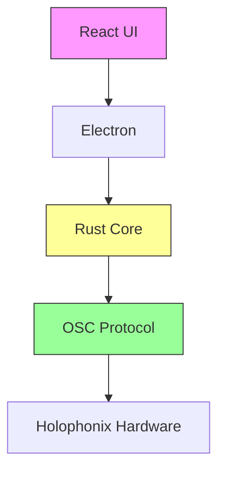
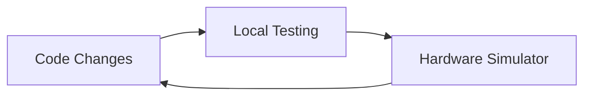
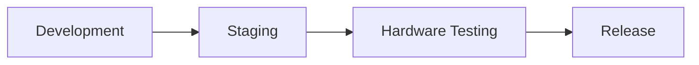

# Holophonix Animator Documentation 📚

Welcome to the Holophonix Animator documentation. This guide will help you understand and contribute to the Holophonix Animator project.

## What is Holophonix Animator? 🎯

Holophonix Animator is a desktop application that lets sound engineers create and control dynamic movements of sound sources in 3D space. Think of it like a choreography tool for sound, where you can:

- Move sound sources smoothly between speakers
- Create complex patterns of movement (circles, figures-of-eight, etc.)
- Synchronize multiple sound sources in formations
- Save and replay movement sequences

### Visual Overview
```
    [Speaker Layout]          [Movement Pattern]
    
    S1    S2    S3           Start
     ○     ○     ○             ↓
                              Path
    S4     •     S5    →       ↓
     ○     ↓     ○           End
         Sound
    S6    S7    S8
     ○     ○     ○
```

## Quick Start 🚀

### 1. Development Setup
```bash
# Clone repository
git clone https://github.com/ORGANIZATION/holophonix-animator.git
cd holophonix-animator

# Install dependencies
npm install
cargo build

# Start development server
npm run dev
```

### 2. Your First Task
After setup, try this simple task to understand the workflow:
1. Start the development server
2. Create a simple linear movement
3. Test it with our simulator
4. Make changes and see live updates

Detailed guide: [Your First Animation](tutorials/first-animation.md)

## System Architecture 🏗️



### Key Components
1. **React UI** (Frontend)
   - User interface and controls
   - Real-time visualization
   - State management (React)

2. **Rust Core** (Backend)
   - Animation computation
   - State management
   - Hardware communication

3. **OSC Protocol** (Communication)
   - Real-time updates (60 FPS)
   - Bi-directional communication
   - Hardware synchronization

## Development Workflow 💻

### 1. Local Development


### 2. Hardware Testing


### 3. Common Development Tasks
1. **UI Changes**
   - Edit React components
   - Hot reload in browser
   - Test with simulator

2. **Animation Logic**
   - Modify Rust core
   - Run unit tests
   - Test with simulator

3. **Hardware Integration**
   - Use hardware simulator
   - Test with real hardware
   - Verify OSC communication

## Project Overview 🎯

1. [Context & Vision](project/context-and-vision.md)
   - Project background
   - Goals and objectives
   - Current status
   - Future roadmap

2. [Architecture](architecture/README.md)
   - [System Overview](architecture/overview.md)
   - [Technical Stack](architecture/tech-stack.md)
   - [Component Design](architecture/components.md)
   - [State Management](architecture/state-management.md)

3. [Core Concepts](core/README.md)
   - [Coordinate Systems](core/coordinate-system.md)
   - [Motion Models](core/motion-models.md)
   - [OSC Protocol](core/osc-protocol.md)
   - [Behaviors](core/behaviors.md)

## Development Guide 💻

### Getting Started
1. [Development Environment](getting-started/development-setup.md)
2. [Basic Tutorial](tutorials/basic-setup.md)
3. [Common Use Cases](tutorials/README.md)

### Development Workflow
1. [Code Style Guide](development/code-style.md)
2. [Git Workflow](development/git-workflow.md)
3. [Testing Guidelines](development/testing-guidelines.md)
4. [Debug Guide](tutorials/debug-guide.md)

### Common Tasks
1. [Creating Animations](tutorials/first-animation.md)
2. [Working with Groups](tutorials/group-management.md)
3. [Performance Optimization](tutorials/performance-optimization.md)

1. [Getting Started](getting-started/README.md)
   - [Development Environment](getting-started/development-setup.md)
   - [Building & Running](getting-started/building.md)
   - [Testing](getting-started/testing.md)

2. [Development Process](development/README.md)
   - [Code Style](development/code-style.md)
   - [Git Workflow](development/git-workflow.md)
   - [Testing Guidelines](development/testing-guidelines.md)
   - [Release Process](development/release-process.md)

3. [Implementation Guide](implementation/README.md)
   - [Frontend Development](implementation/frontend.md)
   - [Animation Core](implementation/animation-core.md)
   - [OSC Communication](implementation/osc-communication.md)
   - [State Management](implementation/state-management.md)

## API Reference 📡

- [OSC Protocol Reference](api/osc-protocol.md)
- [Animation Core API](api/animation-core.md)
- [State Management API](api/state-management.md)

## Troubleshooting 🔧

### Common Issues
1. **Build Failures**
   - Clear npm cache: `npm cache clean --force`
   - Update Rust: `rustup update stable`
   - Rebuild: `cargo clean && cargo build`

2. **Runtime Issues**
   - Check OSC port (default 4003): `lsof -i :4003`
   - Verify environment: `npm run check:env`
   - Test OSC connection: `npm run test:osc`

3. **Performance Issues**
   - Enable debug mode in `.env`
   - Check resource monitor
   - Review animation frame rate

### Getting Help
- [FAQ](help/faq.md)
- [Debug Guide](tutorials/debug-guide.md)
- [Discord Community](https://discord.gg/xyz)
- [GitHub Issues](https://github.com/ORGANIZATION/holophonix-animator/issues)

## Contributing 🤝

We welcome contributions! Please see our [Contributing Guide](CONTRIBUTING.md) for:
- Code of Conduct
- Development Process
- Pull Request Guidelines
- Documentation Standards

## Project Status 📊

- [Development Roadmap](project/roadmap.md)
- [Current Milestone](project/current-milestone.md)
- [Known Issues](project/known-issues.md)

## Need Help? 💬

- [FAQ](help/faq.md)
- [Troubleshooting](help/troubleshooting.md)
- [Report an Issue](https://github.com/ORGANIZATION/holophonix-animator/issues)

## Directory Structure 📂

```
docs/
├── project/                 # Project overview and status
│   ├── context-and-vision.md
│   ├── roadmap.md
│   └── current-milestone.md
├── architecture/           # System architecture and design
│   ├── overview.md
│   ├── tech-stack.md
│   └── diagrams/          # Architecture and flow diagrams
├── design/                # UI/UX design assets
│   └── mockups/          # UI mockups and prototypes
├── core/                  # Core concepts and fundamentals
│   ├── coordinate-system.md
│   ├── motion-models.md
│   └── behaviors.md
├── development/          # Development guidelines
│   ├── code-style.md
│   ├── git-workflow.md
│   └── testing-guidelines.md
├── implementation/       # Implementation details
│   ├── frontend.md
│   ├── animation-core.md
│   └── osc-communication.md
├── api/                 # API documentation
│   ├── osc-protocol.md
│   └── animation-core.md
└── assets/             # Documentation assets
    └── branding/       # Logo and branding files
```

## License 📄

Copyright 2024 HOLOPHONIX S.A.S. All rights reserved.

## Testing Your Setup ✅

### 1. Verify Development Environment
```bash
# Check all dependencies
npm run check:env

# Verify Rust core
cargo test

# Start hardware simulator
npm run simulator
```

### 2. Test Basic Animation
1. Start the app: `npm run dev`
2. Open http://localhost:3000
3. Create a track
4. Apply linear movement
5. Verify in simulator

### 3. Common Test Scenarios
- Create and move single track
- Group multiple tracks
- Test different animation models
- Verify OSC communication
