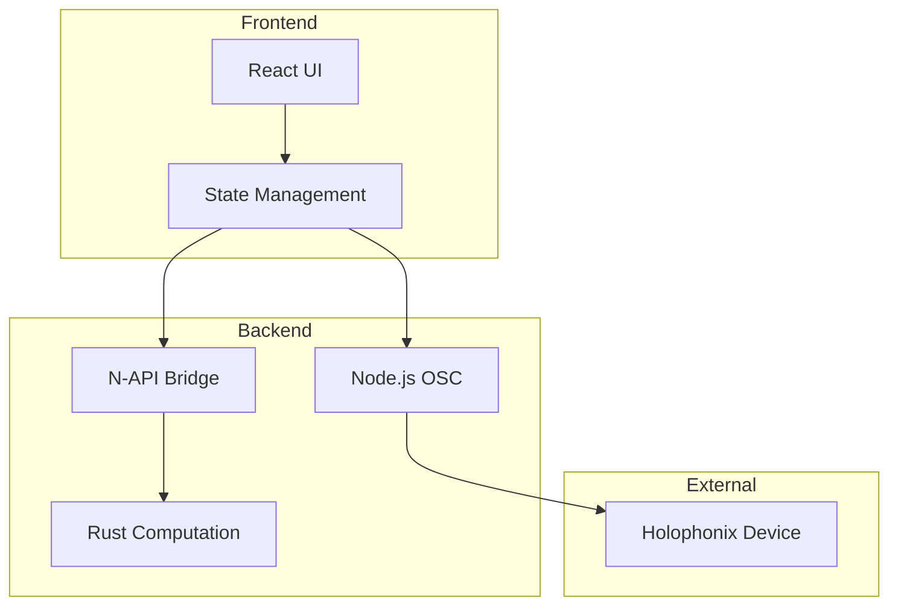
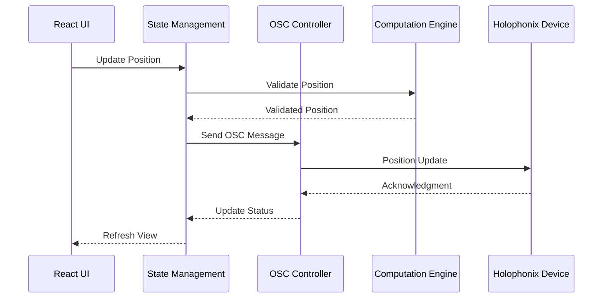
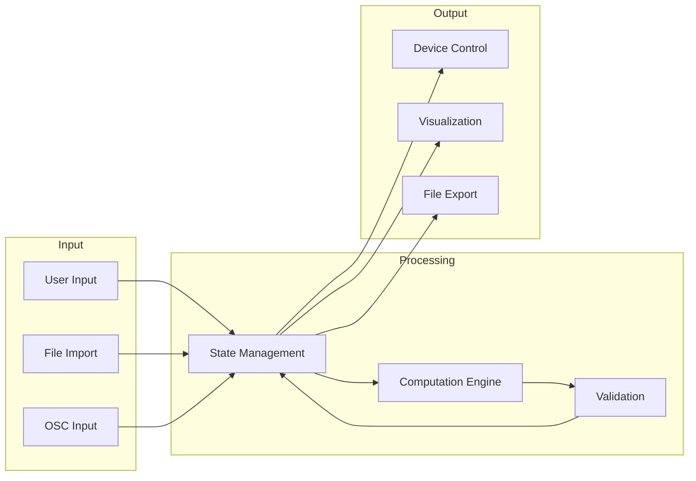

# Architecture Overview

The Holophonix Animator is designed with a hybrid architecture that leverages the strengths of different technologies:
- Node.js for OSC communication and state management
- Rust for high-performance mathematical computations
- Electron for cross-platform desktop integration
- React for responsive user interface

## System Architecture

The Holophonix Animator uses a hybrid architecture combining Node.js and Rust:



### 1. Node.js Core Layer
Handles communication and state management:

- **OSC Communication Layer**
  - UDP socket management via `osc` module
  - Low-latency message processing
  - Binary message optimization
  - Custom message bundling
  - Efficient packet handling
  - Error handling and recovery

- **State Management**
  - Centralized state store
  - Command processing
  - State synchronization
  - Performance monitoring

### 2. Rust Computation Engine
Handles all performance-critical mathematical operations:

- **Motion Calculations**
  - Vector operations
  - Coordinate transformations
  - Trajectory interpolation
  - Complex motion patterns

- **Real-time Processing**
  - High-performance computations
  - Parallel processing capabilities
  - Memory-efficient operations
  - Optimized algorithms

### 3. Electron Layer
Bridge between Node.js core and UI:

- **Main Process**
  - IPC management
  - System integration
  - Configuration handling
  - File system operations

- **Preload Scripts**
  - Secure bridge to renderer
  - API exposure
  - Event handling

### 4. Frontend Layer
User interface and interaction:

- **React Components**
  - Modular UI elements
  - State visualization
  - User input handling
  - Real-time feedback

- **State Management**
  - UI state handling
  - Data flow control
  - Component updates

## Component Communication



## Data Flow



## Core Components

### 1. OSC Communication (Node.js)
```typescript
interface OSCController {
  // Message handling
  sendMessage(address: string, args: OSCArgument[]): Promise<void>;
  sendBundle(messages: OSCMessage[]): Promise<void>;
  
  // Event handling
  onMessage(callback: (message: OSCMessage) => void): void;
  onError(callback: (error: OSCError) => void): void;
}
```

### 2. Computation Engine (Rust)
```rust
pub struct MotionEngine {
    // Core computation
    pub fn calculate_position(&self, time: f64) -> Vector3;
    pub fn interpolate_trajectory(&self, points: &[Vector3]) -> Vec<Vector3>;
    
    // Pattern generation
    pub fn create_circular_motion(&self, params: CircularParams) -> Motion;
    pub fn create_linear_motion(&self, params: LinearParams) -> Motion;
}
```

### 3. State Management (Node.js)
```typescript
interface StateManager {
  // Track management
  addTrack(track: Track): void;
  updateTrackPosition(id: string, position: Vector3): void;
  
  // Animation control
  startAnimation(trackId: string, pattern: MotionPattern): void;
  stopAnimation(trackId: string): void;
  
  // State updates
  subscribe<K extends keyof AppState>(
    key: K,
    callback: (value: AppState[K]) => void
  ): () => void;
}
```

## Performance Considerations

### 1. OSC Communication
- Message batching
- Binary optimization
- UDP socket management
- Connection pooling

### 2. Computation
- SIMD operations
- Memory optimization
- Thread pool management
- Cache utilization

### 3. State Management
- Atomic updates
- Change batching
- Efficient propagation
- Memory management

## Error Handling

### 1. OSC Errors
```typescript
class OSCError extends Error {
  constructor(
    public type: 'connection' | 'message' | 'timeout',
    public retryable: boolean
  ) {
    super();
  }
}

// Error handling
try {
  await oscController.sendMessage(address, args);
} catch (error) {
  if (error instanceof OSCError && error.retryable) {
    await retry(() => oscController.sendMessage(address, args));
  }
}
```

### 2. Computation Errors
```rust
pub enum ComputationError {
    InvalidParameters(String),
    OutOfBounds(String),
    Internal(String)
}

impl MotionEngine {
    pub fn calculate_position(
        &self,
        time: f64
    ) -> Result<Vector3, ComputationError> {
        // Validate and compute
    }
}
```

## Development Guidelines

### 1. Code Organization
- Clear module boundaries
- Type-safe interfaces
- Comprehensive testing
- Performance monitoring

### 2. Error Management
- Structured error types
- Error propagation
- Recovery strategies
- User feedback

### 3. Performance
- Optimization metrics
- Resource monitoring
- Profiling tools
- Benchmark suites
