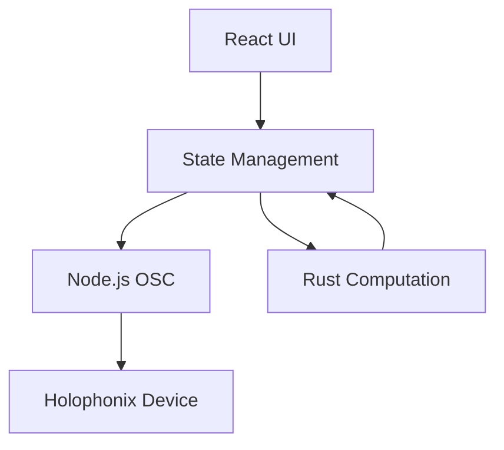

# Data Flow Patterns

## Overview

The Holophonix Animator implements a unidirectional data flow pattern with clear boundaries between components:



## Core Data Flows

### 1. Position Updates
```typescript
interface PositionUpdate {
  trackId: string;
  position: Vector3;
  timestamp: number;
}

// UI Interaction
ui.onPositionChange((update: PositionUpdate) => {
  state.updatePosition(update);
});

// State Processing
state.onPositionUpdate((update: PositionUpdate) => {
  // Validate with computation engine
  const validated = compute.validatePosition(update.position);
  
  // Send to device
  osc.sendPosition(update.trackId, validated);
});
```

### 2. Animation Control
```typescript
interface AnimationControl {
  trackId: string;
  pattern: MotionPattern;
  parameters: Record<string, number>;
}

// Start Animation
ui.onAnimationStart((control: AnimationControl) => {
  // Create pattern in computation engine
  const pattern = compute.createPattern(control.pattern, control.parameters);
  
  // Start animation loop
  state.startAnimation(control.trackId, pattern);
});

// Animation Loop
state.onAnimationFrame((time: number) => {
  // Calculate new position
  const position = compute.calculatePosition(time);
  
  // Send to device
  osc.sendPosition(trackId, position);
});
```

## State Management

### 1. Central State Store
```typescript
interface AppState {
  tracks: Map<string, Track>;
  animations: Map<string, Animation>;
  deviceStatus: DeviceStatus;
  uiState: UIState;
}

class StateManager {
  private state: AppState;
  private subscribers: Set<StateSubscriber>;
  
  // State updates
  updateState<K extends keyof AppState>(
    key: K, 
    value: AppState[K]
  ): void;
  
  // Subscriptions
  subscribe(callback: StateSubscriber): () => void;
}
```

### 2. State Updates
```typescript
// Atomic updates
state.transaction(() => {
  state.updateTrackPosition(id, position);
  state.updateAnimationTime(id, time);
});

// Batched updates
state.batchUpdate([
  { type: 'position', payload: position },
  { type: 'animation', payload: animation }
]);
```

## Performance Optimization

### 1. Message Batching
```typescript
// Bundle related messages
osc.sendBundle({
  timeTag: osc.timeTag(0),
  packets: [
    { address: '/track/1/xyz', args: [1, 2, 3] },
    { address: '/track/1/gain', args: [0.8] }
  ]
});
```

### 2. Computation Optimization
```rust
// Efficient trajectory calculation
pub fn calculate_batch_positions(
    &self,
    pattern: &MotionPattern,
    times: &[f64]
) -> Vec<Vector3> {
    // Use SIMD operations
    // Minimize allocations
    // Cache results
}
```

### 3. State Synchronization
```typescript
// Efficient state updates
class StateSync {
  private updateQueue: UpdateQueue;
  private updateScheduler: UpdateScheduler;
  
  // Batch updates
  queueUpdate(update: StateUpdate): void;
  
  // Process queue
  private processQueue(): void;
}
```

## Error Handling

### 1. Error Propagation
```typescript
try {
  // Attempt operation
  const result = await operation();
} catch (error) {
  if (error instanceof OSCError) {
    // Handle communication error
  } else if (error instanceof ComputationError) {
    // Handle calculation error
  }
  // Notify UI
  ui.showError(error);
}
```

### 2. Recovery Strategies
```typescript
class ErrorRecovery {
  // Retry with backoff
  async retryWithBackoff<T>(
    operation: () => Promise<T>,
    maxAttempts: number
  ): Promise<T>;
  
  // Fallback operations
  async withFallback<T>(
    primary: () => Promise<T>,
    fallback: () => Promise<T>
  ): Promise<T>;
}
```

## Monitoring and Debugging

### 1. Performance Monitoring
```typescript
interface PerformanceMetrics {
  messageLatency: number;
  computationTime: number;
  stateUpdateTime: number;
  frameDrops: number;
}

class PerformanceMonitor {
  recordMetric(key: keyof PerformanceMetrics, value: number): void;
  getMetrics(): PerformanceMetrics;
}
```

### 2. Debug Logging
```typescript
const logger = new Logger({
  levels: ['debug', 'info', 'warn', 'error'],
  context: {
    component: 'dataflow',
    version: '1.0.0'
  }
});

logger.debug('State update', { 
  previous: prevState,
  next: nextState,
  diff: computeDiff(prevState, nextState)
});
