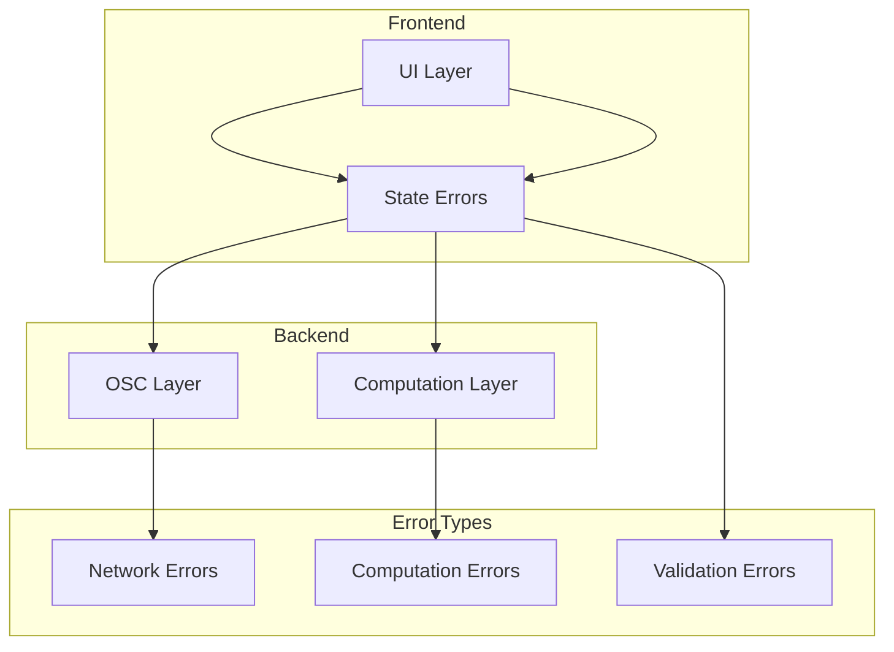

# Error Handling Architecture

## Overview

The Holophonix Animator implements a comprehensive error handling strategy across its Node.js OSC layer, Rust computation engine, and React frontend.

## Error Flow



## Error Types

### 1. OSC Communication Errors
```typescript
enum OSCErrorType {
  CONNECTION = 'connection',
  MESSAGE = 'message',
  TIMEOUT = 'timeout',
  VALIDATION = 'validation'
}

interface OSCError {
  type: OSCErrorType;
  message: string;
  retryable: boolean;
  context?: {
    address?: string;
    args?: OSCArgument[];
    timestamp?: number;
  };
}

class OSCController {
  private async handleError(error: OSCError): Promise<void> {
    if (error.retryable) {
      await this.retryStrategy.execute(async () => {
        // Retry logic
      });
    } else {
      this.errorBus.emit('error', error);
    }
  }
}
```

### 2. Computation Errors (Rust)
```rust
#[derive(Debug)]
pub enum ComputationError {
    // Parameter errors
    InvalidParameter {
        name: String,
        value: String,
        reason: String,
    },
    
    // Boundary errors
    OutOfBounds {
        value: f64,
        min: f64,
        max: f64,
    },
    
    // System errors
    ResourceExhausted {
        resource: String,
        limit: u64,
    },
    
    // Internal errors
    Internal(String),
}

impl MotionEngine {
    pub fn handle_error(
        &self,
        error: ComputationError
    ) -> Result<Recovery, ComputationError> {
        match error {
            ComputationError::OutOfBounds { value, min, max } => {
                // Clamp value to bounds
                Ok(Recovery::Clamp(value.clamp(min, max)))
            },
            ComputationError::InvalidParameter { .. } => {
                // Cannot recover from invalid parameters
                Err(error)
            },
            _ => Err(error)
        }
    }
}
```

### 3. State Management Errors
```typescript
interface StateError {
  type: 'invalid_transition' | 'validation' | 'conflict';
  message: string;
  path: string[];
  value: unknown;
  constraints?: Record<string, string>;
}

class StateManager {
  private handleStateError(error: StateError): void {
    // Log error
    logger.error('State error:', {
      type: error.type,
      path: error.path.join('.'),
      message: error.message
    });
    
    // Notify subscribers
    this.errorBus.emit('state:error', error);
    
    // Attempt recovery
    if (error.type === 'invalid_transition') {
      this.rollbackTransaction();
    }
  }
}
```

## Error Recovery

### 1. Retry Strategies
```typescript
interface RetryStrategy {
  maxAttempts: number;
  backoff: BackoffStrategy;
  shouldRetry: (error: Error) => boolean;
}

class ExponentialBackoff implements BackoffStrategy {
  constructor(
    private baseDelay: number,
    private maxDelay: number,
    private factor: number = 2
  ) {}
  
  getDelay(attempt: number): number {
    const delay = this.baseDelay * Math.pow(this.factor, attempt);
    return Math.min(delay, this.maxDelay);
  }
}

async function withRetry<T>(
  operation: () => Promise<T>,
  strategy: RetryStrategy
): Promise<T> {
  let attempt = 0;
  
  while (attempt < strategy.maxAttempts) {
    try {
      return await operation();
    } catch (error) {
      if (!strategy.shouldRetry(error) || 
          attempt === strategy.maxAttempts - 1) {
        throw error;
      }
      
      const delay = strategy.backoff.getDelay(attempt);
      await new Promise(resolve => setTimeout(resolve, delay));
      attempt++;
    }
  }
  
  throw new Error('Max retry attempts exceeded');
}
```

### 2. Error Recovery Actions
```typescript
interface RecoveryAction {
  type: 'retry' | 'rollback' | 'reset' | 'ignore';
  context: unknown;
}

class ErrorHandler {
  async handleError(error: Error): Promise<void> {
    const action = this.determineRecoveryAction(error);
    
    switch (action.type) {
      case 'retry':
        await this.retryOperation(action.context);
        break;
      case 'rollback':
        await this.rollbackState(action.context);
        break;
      case 'reset':
        await this.resetSystem();
        break;
      case 'ignore':
        this.logWarning(error);
        break;
    }
  }
}
```

## User Feedback

### 1. Error Notifications
```typescript
interface ErrorNotification {
  title: string;
  message: string;
  type: 'error' | 'warning' | 'info';
  actions?: {
    label: string;
    handler: () => void;
  }[];
}

class NotificationManager {
  showError(error: Error): void {
    const notification = this.createNotification(error);
    
    toast.error(notification.message, {
      title: notification.title,
      duration: 5000,
      action: notification.actions
    });
  }
  
  private createNotification(error: Error): ErrorNotification {
    if (error instanceof OSCError) {
      return {
        title: 'Connection Error',
        message: 'Failed to communicate with device',
        type: 'error',
        actions: [{
          label: 'Retry',
          handler: () => this.retryConnection()
        }]
      };
    }
    
    // Handle other error types...
  }
}
```

### 2. Error Boundaries
```typescript
class ErrorBoundary extends React.Component<
  PropsWithChildren<{
    fallback: React.ReactNode;
    onError?: (error: Error) => void;
  }>,
  { hasError: boolean }
> {
  state = { hasError: false };
  
  static getDerivedStateFromError() {
    return { hasError: true };
  }
  
  componentDidCatch(error: Error, info: React.ErrorInfo) {
    this.props.onError?.(error);
    
    logger.error('React error:', {
      error: error.message,
      componentStack: info.componentStack
    });
  }
  
  render() {
    if (this.state.hasError) {
      return this.props.fallback;
    }
    
    return this.props.children;
  }
}
```

## Logging

### 1. Error Logging
```typescript
interface LogEntry {
  level: 'error' | 'warn' | 'info';
  message: string;
  timestamp: number;
  context: Record<string, unknown>;
}

class Logger {
  private async logError(
    error: Error,
    context: Record<string, unknown>
  ): Promise<void> {
    const entry: LogEntry = {
      level: 'error',
      message: error.message,
      timestamp: Date.now(),
      context: {
        ...context,
        stack: error.stack,
        name: error.name
      }
    };
    
    await this.persistLog(entry);
    
    if (this.shouldNotifyRemote(error)) {
      await this.notifyRemoteSystem(entry);
    }
  }
}
```

### 2. Performance Monitoring
```typescript
interface PerformanceMetrics {
  timestamp: number;
  memory: {
    heapUsed: number;
    heapTotal: number;
  };
  cpu: {
    user: number;
    system: number;
  };
  fps: number;
}

class PerformanceMonitor {
  private metrics: PerformanceMetrics[] = [];
  
  collectMetrics(): void {
    const metrics = {
      timestamp: Date.now(),
      memory: process.memoryUsage(),
      cpu: process.cpuUsage(),
      fps: this.calculateFPS()
    };
    
    this.metrics.push(metrics);
    
    if (this.shouldWarn(metrics)) {
      this.emitWarning(metrics);
    }
  }
}
```

## Best Practices

### 1. Error Prevention
- Validate inputs early
- Use strong typing
- Check bounds and constraints
- Implement proper error boundaries

### 2. Error Recovery
- Implement retry mechanisms
- Use fallback operations
- Maintain consistent state
- Provide user feedback

### 3. Error Monitoring
- Log errors with context
- Track error metrics
- Monitor error patterns
- Alert on critical errors

For specific implementation details, see:
- [Frontend Architecture](../react/frontend-architecture.md)
- [Node Integration](../rust-core/node-bridge/node-integration.md)
- [State Management](../rust-core/state-manager/state-management.md)
