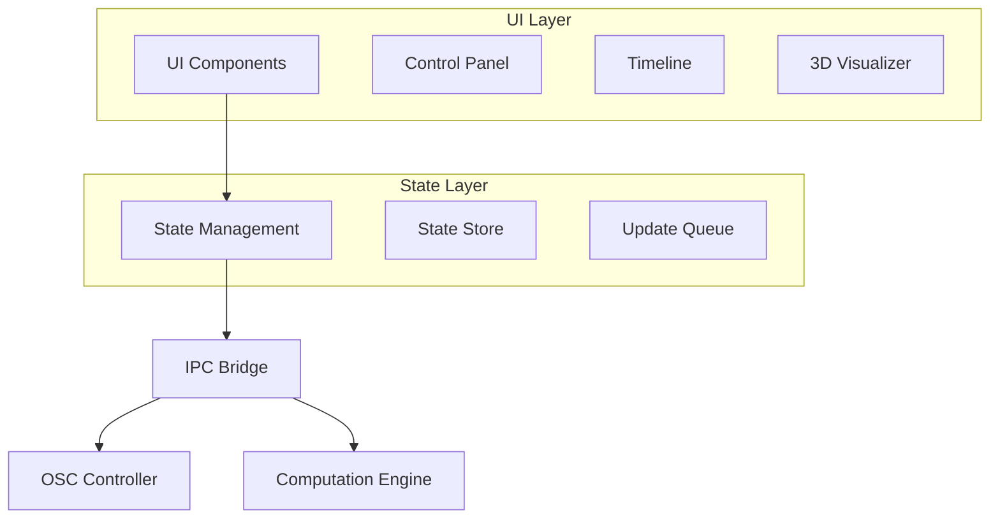

# Frontend Architecture

## Overview

The frontend architecture follows a component-based design with React, focusing on performance and real-time updates:



## Core Components

### 1. Track Controller
```typescript
interface TrackControllerProps {
  trackId: string;
  position: Vector3;
  onPositionChange: (position: Vector3) => void;
  onAnimationStart: (pattern: MotionPattern) => void;
}

const TrackController: React.FC<TrackControllerProps> = ({
  trackId,
  position,
  onPositionChange,
  onAnimationStart
}) => {
  const handlePositionChange = useCallback((newPos: Vector3) => {
    onPositionChange(newPos);
  }, [onPositionChange]);
  
  return (
    <div className="track-controller">
      <PositionControls
        position={position}
        onChange={handlePositionChange}
      />
      <AnimationControls
        onStart={onAnimationStart}
      />
    </div>
  );
};
```

### 2. Timeline
```typescript
interface TimelineProps {
  duration: number;
  markers: TimelineMarker[];
  currentTime: number;
  onTimeChange: (time: number) => void;
}

const Timeline: React.FC<TimelineProps> = ({
  duration,
  markers,
  currentTime,
  onTimeChange
}) => {
  const [isDragging, setIsDragging] = useState(false);
  
  const handleTimeUpdate = useCallback((time: number) => {
    if (time >= 0 && time <= duration) {
      onTimeChange(time);
    }
  }, [duration, onTimeChange]);
  
  return (
    <div className="timeline">
      <TimelineRuler duration={duration} />
      <TimelineMarkers markers={markers} />
      <TimelineCursor
        time={currentTime}
        onChange={handleTimeUpdate}
      />
    </div>
  );
};
```

### 3. 3D Visualizer
```typescript
interface VisualizerProps {
  tracks: Track[];
  patterns: MotionPattern[];
  onTrackSelect: (trackId: string) => void;
}

const Visualizer: React.FC<VisualizerProps> = ({
  tracks,
  patterns,
  onTrackSelect
}) => {
  const threeRef = useRef<HTMLDivElement>(null);
  const renderer = useThreeRenderer(threeRef);
  
  useEffect(() => {
    // Update track positions
    tracks.forEach(track => {
      updateTrackPosition(renderer, track);
    });
    
    // Update pattern visualizations
    patterns.forEach(pattern => {
      updatePatternPath(renderer, pattern);
    });
  }, [tracks, patterns, renderer]);
  
  return (
    <div ref={threeRef} className="visualizer">
      <VisualizerControls />
      <VisualizerStats />
    </div>
  );
};
```

## State Management

### 1. Application State
```typescript
interface AppState {
  tracks: Map<string, Track>;
  patterns: Map<string, MotionPattern>;
  timeline: TimelineState;
  ui: UIState;
}

const useAppState = () => {
  const [state, dispatch] = useReducer(appReducer, initialState);
  
  const updateTrack = useCallback((
    trackId: string,
    update: Partial<Track>
  ) => {
    dispatch({
      type: 'UPDATE_TRACK',
      payload: { trackId, update }
    });
  }, []);
  
  return {
    state,
    updateTrack,
    // Other actions...
  };
};
```

### 2. IPC Bridge
```typescript
const useIPCBridge = () => {
  const sendMessage = useCallback(async (
    channel: string,
    payload: any
  ) => {
    return window.electron.ipcRenderer.invoke(channel, payload);
  }, []);
  
  useEffect(() => {
    const handleStateUpdate = (update: StateUpdate) => {
      dispatch({
        type: 'STATE_UPDATE',
        payload: update
      });
    };
    
    window.electron.ipcRenderer.on('state:update', handleStateUpdate);
    return () => {
      window.electron.ipcRenderer.off('state:update', handleStateUpdate);
    };
  }, []);
  
  return { sendMessage };
};
```

## Performance Optimization

### 1. Rendering Optimization
```typescript
const useOptimizedRender = <T extends any[]>(
  renderFn: (...args: T) => void,
  deps: T
) => {
  const frameRef = useRef<number>();
  
  useEffect(() => {
    if (frameRef.current) {
      cancelAnimationFrame(frameRef.current);
    }
    
    frameRef.current = requestAnimationFrame(() => {
      renderFn(...deps);
    });
    
    return () => {
      if (frameRef.current) {
        cancelAnimationFrame(frameRef.current);
      }
    };
  }, deps);
};
```

### 2. State Updates
```typescript
const useBatchedUpdates = <T extends any>(
  updateFn: (value: T) => void,
  delay: number = 16
) => {
  const batchRef = useRef<T[]>([]);
  const timerRef = useRef<number>();
  
  const queueUpdate = useCallback((value: T) => {
    batchRef.current.push(value);
    
    if (!timerRef.current) {
      timerRef.current = window.setTimeout(() => {
        const updates = batchRef.current;
        batchRef.current = [];
        timerRef.current = undefined;
        
        updateFn(updates[updates.length - 1]);
      }, delay);
    }
  }, [updateFn, delay]);
  
  return queueUpdate;
};
```

## Error Handling

### 1. Error Boundaries
```typescript
class AppErrorBoundary extends React.Component<
  PropsWithChildren<{}>,
  { hasError: boolean }
> {
  state = { hasError: false };
  
  static getDerivedStateFromError(error: Error) {
    return { hasError: true };
  }
  
  componentDidCatch(error: Error, info: React.ErrorInfo) {
    logger.error('React Error:', error, info);
  }
  
  render() {
    if (this.state.hasError) {
      return <ErrorFallback />;
    }
    return this.props.children;
  }
}
```

### 2. Error Notifications
```typescript
const useErrorNotification = () => {
  const showError = useCallback((
    title: string,
    message: string
  ) => {
    toast.error(message, {
      title,
      duration: 5000,
      position: 'top-right'
    });
  }, []);
  
  return { showError };
};
```

## Testing Strategy

### 1. Component Testing
```typescript
describe('TrackController', () => {
  it('handles position updates', async () => {
    const onPositionChange = jest.fn();
    const { getByRole } = render(
      <TrackController
        trackId="1"
        position={{ x: 0, y: 0, z: 0 }}
        onPositionChange={onPositionChange}
      />
    );
    
    const input = getByRole('slider');
    fireEvent.change(input, { target: { value: '1' } });
    
    expect(onPositionChange).toHaveBeenCalledWith({
      x: 1,
      y: 0,
      z: 0
    });
  });
});
```

### 2. Integration Testing
```typescript
describe('App Integration', () => {
  it('handles full animation cycle', async () => {
    const { getByText, findByText } = render(<App />);
    
    // Start animation
    fireEvent.click(getByText('Start Animation'));
    
    // Wait for animation to complete
    await findByText('Animation Complete');
    
    // Verify final state
    expect(getByText('Position')).toHaveTextContent('1.0, 0.0, 0.0');
  });
});
