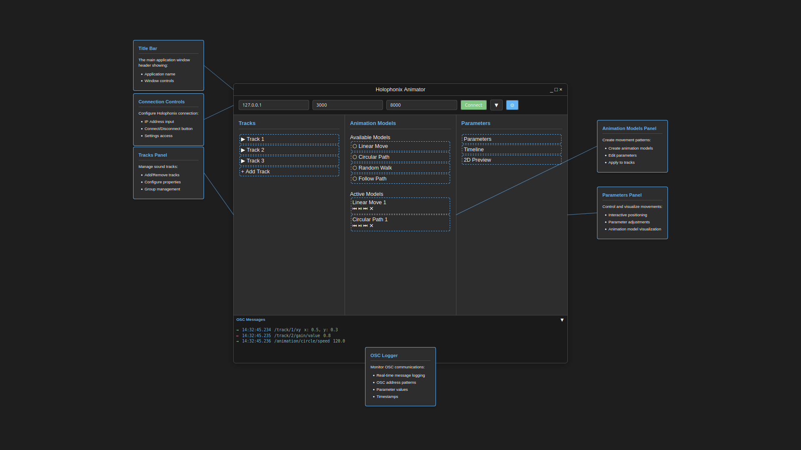

# UI Mockup (Previous Development)

This mockup was created during the previous development attempt and serves as a reference for the overall UI structure and functionality.



## UI Components

### 1. Title Bar
- Application name
- Window controls

### 2. Connection Controls
- IP address input (default: 127.0.0.1)
- Port inputs (3000, 8000)
- Connect/Disconnect button
- Settings access

### 3. Tracks Panel
- Track list management
- Add/Remove tracks
- Configure properties
- Group management

### 4. Animation Models Panel
- Available Models:
  - Linear Move
  - Circular Path
  - Random Walk
  - Follow Path
- Active Models:
  - Shows currently active animations
  - Parameter controls

### 5. Parameters Panel
- Parameter adjustments
- Timeline controls
- 2D Preview
- Animation model visualization

### 6. OSC Logger
- Real-time message logging
- OSC address patterns
- Parameter values
- Timestamps

## Example OSC Messages
```
14:32:45.234 /track/1/xy x: 0.5, y: 0.3
14:32:45.235 /track/2/path/value 0.8
14:32:45.236 /animation/circle/speed 120.0
```

*Note: This mockup serves as a reference for the UI layout and features. The actual implementation will be driven by TDD methodology, ensuring all functionality is properly tested before UI development.*
