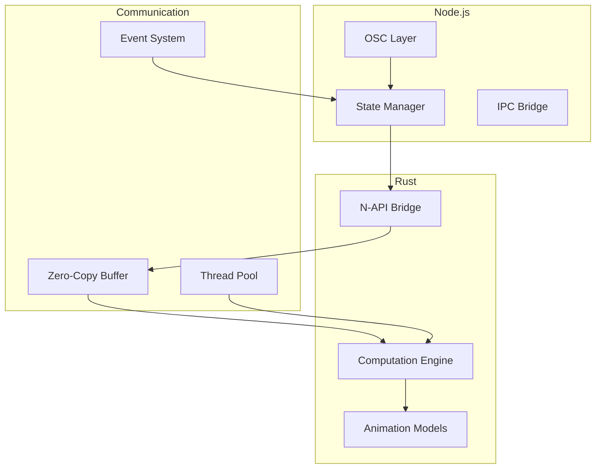

# Node.js Integration

## Overview

The Node.js bridge provides seamless integration between the Rust computation engine and Node.js OSC communication layer:



## Bridge Architecture

### 1. N-API Implementation

```rust
#[napi]
pub struct Bridge {
    engine: Arc<MotionEngine>,
    state: Arc<RwLock<State>>,
    thread_pool: ThreadPool,
    event_bus: EventBus,
}

#[napi]
impl Bridge {
    #[napi(constructor)]
    pub fn new() -> Self {
        Bridge {
            engine: Arc::new(MotionEngine::new()),
            state: Arc::new(RwLock::new(State::new())),
            thread_pool: ThreadPool::new(),
            event_bus: EventBus::new(),
        }
    }
    
    #[napi]
    pub async fn calculate_position(
        &self,
        pattern: PatternInput,
        time: f64
    ) -> Result<Position, Error> {
        let engine = self.engine.clone();
        let pattern = pattern.into();
        
        self.thread_pool
            .spawn_async(move || {
                engine.calculate_position(pattern, time)
            })
            .await
            .map(Position::from)
            .map_err(Error::from)
    }
    
    #[napi]
    pub fn subscribe_to_events(
        &self,
        callback: JsFunction
    ) -> Result<(), Error> {
        let tsfn = ThreadsafeFunction::new(callback)?;
        
        self.event_bus.subscribe(move |event| {
            tsfn.call(Ok(event), ThreadsafeFunctionCallMode::NonBlocking);
        });
        
        Ok(())
    }
}
```

### 2. Zero-Copy Buffer Sharing

```rust
#[napi]
pub struct SharedBuffer {
    data: *mut u8,
    length: usize,
}

#[napi]
impl SharedBuffer {
    #[napi(constructor)]
    pub fn new(capacity: u32) -> Self {
        let layout = Layout::array::<u8>(capacity as usize).unwrap();
        let data = unsafe { alloc(layout) };
        
        SharedBuffer {
            data,
            length: capacity as usize,
        }
    }
    
    #[napi]
    pub fn as_slice(&self) -> &[u8] {
        unsafe {
            std::slice::from_raw_parts(self.data, self.length)
        }
    }
    
    #[napi]
    pub fn as_mut_slice(&mut self) -> &mut [u8] {
        unsafe {
            std::slice::from_raw_parts_mut(self.data, self.length)
        }
    }
}

impl Drop for SharedBuffer {
    fn drop(&mut self) {
        unsafe {
            dealloc(
                self.data,
                Layout::array::<u8>(self.length).unwrap()
            );
        }
    }
}
```

### 3. Thread Pool Management

```rust
pub struct ThreadPool {
    workers: Vec<Worker>,
    sender: mpsc::Sender<Message>,
}

impl ThreadPool {
    pub fn new() -> Self {
        let size = num_cpus::get();
        let (sender, receiver) = mpsc::channel();
        let receiver = Arc::new(Mutex::new(receiver));
        
        let mut workers = Vec::with_capacity(size);
        
        for id in 0..size {
            workers.push(Worker::new(id, Arc::clone(&receiver)));
        }
        
        ThreadPool { workers, sender }
    }
    
    pub async fn spawn_async<F, T>(&self, f: F) -> Result<T, Error>
    where
        F: FnOnce() -> Result<T, Error> + Send + 'static,
        T: Send + 'static,
    {
        let (tx, rx) = oneshot::channel();
        
        self.sender.send(Message::NewJob(Box::new(move || {
            let result = f();
            let _ = tx.send(result);
        })))?;
        
        rx.await?
    }
}
```

### 4. Event System

```rust
pub struct EventBus {
    subscribers: Arc<RwLock<Vec<Box<dyn Fn(Event) + Send + Sync>>>>,
}

impl EventBus {
    pub fn new() -> Self {
        EventBus {
            subscribers: Arc::new(RwLock::new(Vec::new())),
        }
    }
    
    pub fn subscribe<F>(&self, callback: F)
    where
        F: Fn(Event) + Send + Sync + 'static,
    {
        let mut subscribers = self.subscribers.write().unwrap();
        subscribers.push(Box::new(callback));
    }
    
    pub fn emit(&self, event: Event) {
        let subscribers = self.subscribers.read().unwrap();
        for subscriber in subscribers.iter() {
            subscriber(event.clone());
        }
    }
}

#[derive(Clone)]
pub enum Event {
    StateUpdate(StateUpdate),
    Error(Error),
    Performance(Metrics),
}
```

## Error Handling

```rust
#[napi]
#[derive(Debug)]
pub struct Error {
    pub code: String,
    pub message: String,
    pub recoverable: bool,
    pub context: Option<String>,
}

impl From<ComputationError> for Error {
    fn from(error: ComputationError) -> Self {
        match error {
            ComputationError::InvalidParameter { name, value, reason } => {
                Error {
                    code: "INVALID_PARAMETER".into(),
                    message: format!("Invalid parameter {}: {}", name, reason),
                    recoverable: false,
                    context: Some(value),
                }
            }
            ComputationError::OutOfBounds { value, min, max } => {
                Error {
                    code: "OUT_OF_BOUNDS".into(),
                    message: format!("Value {} out of bounds [{}, {}]", value, min, max),
                    recoverable: true,
                    context: None,
                }
            }
            // Handle other error types...
        }
    }
}
```

## Performance Monitoring

```rust
#[napi]
pub struct BridgeMetrics {
    computation_time: HistogramTimer,
    memory_usage: Gauge,
    thread_pool_size: Gauge,
    active_workers: Counter,
    error_count: Counter,
}

#[napi]
impl BridgeMetrics {
    #[napi]
    pub fn record_computation(&self, duration: f64) {
        self.computation_time.record(duration);
    }
    
    #[napi]
    pub fn record_memory(&self, bytes: f64) {
        self.memory_usage.set(bytes);
    }
    
    #[napi]
    pub fn record_worker_start(&self) {
        self.active_workers.inc();
    }
    
    #[napi]
    pub fn record_worker_stop(&self) {
        self.active_workers.dec();
    }
}
