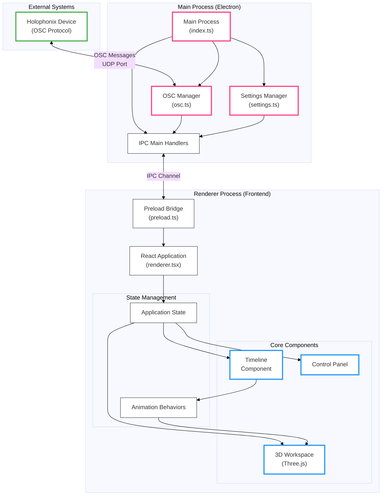

# Holophonix Animator System Interactions

This document provides a comprehensive view of the system interactions within the Holophonix Animator application.

## System Interaction Diagram

## Editing the Diagram

This diagram is created using Mermaid, a markdown-based diagramming tool. You can edit and visualize this diagram using several methods:

1. **Online Mermaid Editor**:
   - Visit [Mermaid Live Editor](https://mermaid.live)
   - Copy and paste the diagram code between the \`\`\`mermaid markers
   - Edit in real-time with live preview

2. **VS Code**:
   - Install the "Markdown Preview Mermaid Support" extension
   - Open this file in VS Code
   - Use the markdown preview to see the diagram
   - Edit the code directly in the editor

3. **Local Development**:
   - Install Mermaid CLI: `npm install -g @mermaid-js/mermaid-cli`
   - Generate PNG: `mmdc -i system-interactions.md -o system-interactions.png`

4. **GitHub**:
   - GitHub natively supports Mermaid diagrams in markdown
   - View this file directly on GitHub to see the rendered diagram
   - Edit directly in GitHub's web interface

## Component Descriptions

### External Systems
- **Holophonix Device**: External hardware that communicates via OSC protocol

### Main Process
- **Main Process**: Core Electron process managing the application
- **OSC Manager**: Handles OSC communication with rate limiting and queuing
- **Settings Manager**: Manages application configuration
- **IPC Main Handlers**: Coordinates inter-process communication

### Renderer Process
- **Preload Bridge**: Secure bridge between main and renderer processes
- **React Application**: Main UI application
- **Core Components**: Timeline, 3D Workspace, and Control Panel
- **State Management**: Application state and animation behaviors

## Data Flow

1. **OSC Communication**:
   - Bidirectional communication with Holophonix Device
   - Message queuing and rate limiting
   - UDP port handling

2. **Inter-Process Communication**:
   - Secure IPC channel between main and renderer
   - Type-safe API through preload bridge
   - Event forwarding system

3. **UI Updates**:
   - State management in renderer process
   - Component updates based on state changes
   - Animation behavior system integration

## Notes for Modification

When modifying this diagram:
1. Maintain the existing structure of process separation
2. Use appropriate class definitions for visual distinction
3. Keep connections logical and clear
4. Add new components within appropriate subgraphs
5. Document new connections in the Component Descriptions section
