# ⚠️ Restart Required After Preload Changes

## What Happened

The `preload.ts` file was modified to add the main process animation timer API, but **Electron doesn't hot-reload the preload script**.

## Why You Got the Error

```
TypeError: window.electronAPI.onAnimationTick is not a function
```

The preload script runs only when Electron starts. Changes to it require a complete application restart.

---

## Quick Fix

### 1. Stop the Development Server
```bash
# Press Ctrl+C in both terminals:
# - Terminal 1: Vite dev server (npm run dev)
# - Terminal 2: Electron app (npm run electron:dev)
```

### 2. Restart Both Services
```bash
# Terminal 1: Start Vite dev server
npm run dev

# Terminal 2: Start Electron app (wait for Vite to finish)
npm run electron:dev
```

### 3. Verify the Fix
```typescript
// Test in browser console
console.log(window.electronAPI.onAnimationTick); 
// Should output: [Function: onAnimationTick]
```

---

## Technical Explanation

### Electron Preload Script Lifecycle

```mermaid
graph TD
    A[Electron Starts] --> B[Load preload.ts]
    B --> C[Create contextBridge]
    C --> D[Attach to window.electronAPI]
    D --> E[Renderer Process Loads]
    E --> F[App Runs]
    
    G[Developer Changes preload.ts] --> H[Hot Reload Attempts]
    H --> I[❌ Preload Not Reloaded]
    I --> J[Stale API Available]
    J --> K[Runtime Errors]
    
    L[Developer Restarts App] --> M[✅ Fresh Preload Load]
    M --> N[Updated API Available]
```



### What Changed in Preload

```typescript
// preload.ts - Added animation timer API
contextBridge.exposeInMainWorld('electronAPI', {
  // Existing APIs...
  openFile: () => ipcRenderer.invoke('dialog:openFile'),
  saveFile: (data: string) => ipcRenderer.invoke('dialog:saveFile', data),
  
  // ✅ NEW: Animation timer API
  onAnimationTick: (callback: (timestamp: number) => void) => {
    ipcRenderer.on('animation-tick', (_, timestamp) => callback(timestamp));
  },
  
  // ✅ NEW: Timer control
  startAnimationTimer: () => ipcRenderer.invoke('animation:startTimer'),
  stopAnimationTimer: () => ipcRenderer.invoke('animation:stopTimer')
});
```

### Main Process Integration

```typescript
// main.ts - Added timer support
ipcMain.handle('animation:startTimer', () => {
  if (animationTimer) return; // Already running
  
  animationTimer = setInterval(() => {
    if (mainWindow) {
      mainWindow.webContents.send('animation-tick', performance.now());
    }
  }, 1000 / 60); // 60 FPS
});

ipcMain.handle('animation:stopTimer', () => {
  if (animationTimer) {
    clearInterval(animationTimer);
    animationTimer = null;
  }
});
```

---

## Prevention Tips

### 1. Clear Development Notifications
Add this to your development workflow:

```typescript
// In preload.ts, add version checking
const PRELOAD_VERSION = '2.0.0';

contextBridge.exposeInMainWorld('electronAPI', {
  getVersion: () => PRELOAD_VERSION,
  
  // Check for stale preload in renderer
  checkPreloadVersion: () => {
    const rendererVersion = '2.0.0'; // Match with package.json
    if (window.electronAPI.getVersion() !== rendererVersion) {
      console.warn('⚠️ Preload script version mismatch - restart required');
      return false;
    }
    return true;
  }
});
```

### 2. Development Watch Script
Create a helper script to detect preload changes:

```json
// package.json - Add watch script
{
  "scripts": {
    "dev:watch": "concurrently \"npm run dev\" \"npm run watch:preload\"",
    "watch:preload": "nodemon --watch src/preload.ts --exec \"echo '⚠️ Preload changed - restart required!'\""
  }
}
```

### 3. Automatic Restart Detection
Add to main process:

```typescript
// main.ts - Detect preload changes during development
if (process.env.NODE_ENV === 'development') {
  const fs = require('fs');
  let lastPreloadModTime = fs.statSync('preload.ts').mtime;
  
  setInterval(() => {
    const currentModTime = fs.statSync('preload.ts').mtime;
    if (currentModTime > lastPreloadModTime) {
      console.log('🔄 Preload script changed - restart recommended');
      lastPreloadModTime = currentModTime;
    }
  }, 5000);
}
```

---

## Common Preload-Related Issues

### Issue: Context Bridge Errors
```
Uncaught ReferenceError: require is not defined
```
**Cause**: Trying to use Node.js APIs in renderer process
**Fix**: Expose through contextBridge in preload

### Issue: API Not Available
```
window.electronAPI.myFunction is not a function
```
**Cause**: Preload not reloaded after changes
**Fix**: Restart Electron application

### Issue: Security Policy Violations
```
Uncaught EvalError: Refused to evaluate a string as JavaScript
```
**Cause**: Missing contextIsolation settings
**Fix**: Ensure webSecurity and contextIsolation are properly configured

---

## Development Workflow Best Practices

### 1. Preload Change Checklist
When modifying `preload.ts`:
- [ ] Make your changes
- [ ] Stop the development server (Ctrl+C)
- [ ] Restart both Vite and Electron
- [ ] Test the new API in browser console
- [ ] Verify contextBridge exposure

### 2. Fast Development Iteration
For rapid preload development:
```bash
# Use this script for faster restarts
npm run dev:restart

# package.json
{
  "scripts": {
    "dev:restart": "pkill -f electron && sleep 1 && npm run electron:dev"
  }
}
```

### 3. Debug Preload Issues
Add debugging to preload:
```typescript
// preload.ts - Debug version
console.log('🔧 Preload script loading...');

contextBridge.exposeInMainWorld('electronAPI', {
  // Debug function
  debug: () => {
    console.log('✅ Preload API working');
    return { 
      availableFunctions: Object.keys(window.electronAPI),
      timestamp: new Date().toISOString()
    };
  }
});

console.log('✅ Preload script loaded successfully');
```

---

## Verification Steps

After restarting, verify the preload is working:

### 1. Check API Availability
```javascript
// Browser console
console.log('Available APIs:', Object.keys(window.electronAPI));
// Should show: ['openFile', 'saveFile', 'onAnimationTick', ...]
```

### 2. Test New Functions
```javascript
// Test animation timer
window.electronAPI.onAnimationTick((timestamp) => {
  console.log('Timer tick:', timestamp);
});

// Start timer
window.electronAPI.startAnimationTimer();
// Should see timer ticks in console
```

### 3. Verify Context Bridge
```javascript
// Check security context
console.log('Context isolated:', typeof require === 'undefined');
// Should be: true (require is undefined in renderer)
```

---

## Files Affected

When preload changes require restart:
- ✅ `preload.ts` - Main preload script (requires restart)
- ✅ `main.ts` - Main process IPC handlers (requires restart)
- ❌ `src/` files - Renderer code (hot reloads fine)
- ❌ `index.html` - HTML file (hot reloads fine)

---

**Restart Time**: 10 seconds
**Impact**: New APIs become available
**Prevention**: Use watch scripts and version checking
**Note**: This is normal Electron behavior, not a bug
