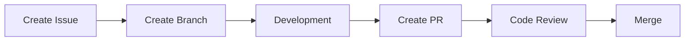

# Development Progress Tracking 📊

## Overview

This guide outlines how we track development progress and manage tasks in the Holophonix Animator project.

## Progress Tracking Tools

### 1. GitHub Project Board
- **Location**: [GitHub Projects](https://github.com/ORGANIZATION/holophonix-animator/projects)
- **Purpose**: High-level feature and milestone tracking
- **Update Frequency**: Weekly sync

### 2. Issue Tracker
- **Location**: [GitHub Issues](https://github.com/ORGANIZATION/holophonix-animator/issues)
- **Labels**:
  - `priority: high/medium/low`
  - `type: bug/feature/enhancement`
  - `status: in-progress/review/blocked`
  - `component: ui/core/osc`

## Development Workflow

### 1. Feature Development


### 2. Task States
1. **Backlog**
   - Prioritized list of future work
   - Estimated complexity
   - Dependencies noted

2. **In Progress**
   - Assigned developer
   - Expected completion date
   - Blockers identified

3. **Review**
   - Code review
   - Testing verification
   - Documentation updates

4. **Done**
   - Merged to main
   - Deployed to staging
   - Verified in production

## Task Management

### 1. Creating Tasks
```markdown
### Task Title
**Priority**: High/Medium/Low
**Component**: UI/Core/OSC
**Estimated Time**: X days
**Dependencies**: #issue-number

#### Description
Clear description of what needs to be done

#### Acceptance Criteria
- [ ] Criteria 1
- [ ] Criteria 2
- [ ] Tests added
- [ ] Documentation updated
```

### 2. Progress Updates
- Comment on issues with blockers
- Update status labels
- Link related PRs
- Tag relevant team members

### 3. Code Review Process
- Create detailed PR description
- Add screenshots/videos if UI changes
- Request specific reviewers
- Address feedback promptly

## Progress Monitoring

### 1. Daily Updates
- Update issue status
- Comment on blockers
- Review assigned tasks
- Update time estimates

### 2. Weekly Sync
- Review milestone progress
- Update project board
- Adjust priorities
- Plan next week

### 3. Milestone Review
- Check feature completion
- Verify documentation
- Review test coverage
- Plan next milestone

## Development TODOs

### Current Sprint
Track your daily progress here:

```markdown
### Today's Tasks
- [ ] Task 1
  - Status: In Progress
  - Blockers: None
  - Next Steps: Implementation
- [ ] Task 2
  - Status: Blocked
  - Blockers: Waiting for API
  - Next Steps: Follow up

### This Week's Goals
1. Feature X Implementation
   - [ ] Component A
   - [ ] Component B
   - [ ] Tests
2. Bug Fixes
   - [ ] Issue #123
   - [ ] Issue #124

### Upcoming
1. Next Week
   - Feature Y planning
   - Performance optimization
2. Next Sprint
   - New UI components
   - State management improvements
```

## Best Practices

### 1. Task Creation
- Be specific and detailed
- Include acceptance criteria
- Link related issues/docs
- Add relevant labels

### 2. Progress Updates
- Daily status updates
- Clear blocker description
- Tag relevant people
- Include context

### 3. Documentation
- Update as you code
- Include examples
- Link to related docs
- Keep diagrams current

## Common Pitfalls

### 1. Task Management
- Incomplete descriptions
- Missing acceptance criteria
- Unclear dependencies
- No time estimates

### 2. Progress Tracking
- Outdated status
- Missing blockers
- No progress updates
- Incomplete documentation

### 3. Communication
- Late blocker notification
- Unclear status updates
- Missing context
- No follow-up

## Templates

### 1. Issue Template
```markdown
### Overview
[Brief description of the issue/feature]

### Current Behavior
[What currently happens, if a bug]

### Expected Behavior
[What should happen]

### Steps to Reproduce
1. Step 1
2. Step 2
3. Step 3

### Additional Context
- Environment details
- Screenshots
- Related issues

### Acceptance Criteria
- [ ] Criteria 1
- [ ] Criteria 2
- [ ] Tests added
- [ ] Documentation updated
```

### 2. PR Template
```markdown
### Changes
[Description of changes]

### Testing
- [ ] Unit tests
- [ ] Integration tests
- [ ] Manual testing

### Documentation
- [ ] Code comments
- [ ] API documentation
- [ ] User guide updates

### Screenshots
[If applicable]

### Related Issues
Fixes #issue-number
```

## Need Help?

- Check [Development Guidelines](./README.md)
- Review [Code Style Guide](./code-style.md)
- Join team chat on Discord
- Tag maintainers in issues
